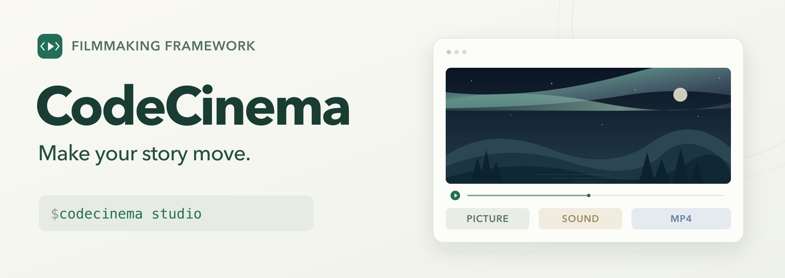
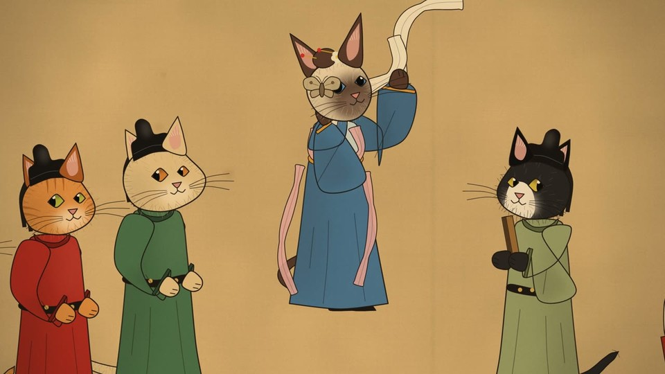

<h1 align="center">CodeCinema</h1>

<p align="center">
  <a href="https://zjucqr.github.io/CodeCinema/"><strong>Project page</strong></a> ·
  <a href="#quick-start"><strong>Quick start</strong></a> ·
  <a href="#framework">Framework</a> ·
  <a href="README.zh-CN.md">简体中文</a>
</p>

<p align="center">
  <a href="https://github.com/ZJUCQR/CodeCinema/actions/workflows/ci.yml"></a>
  <a href="LICENSE"></a>
  <a href="#quick-start"></a>
  <a href="#quick-start"></a>
  <a href="#blender"></a>
</p>

<p align="center">
  <a href="https://zjucqr.github.io/CodeCinema/#films">
    
  </a>
</p>

---

CodeCinema is an extensible, open-source filmmaking framework for picture, music, sound and the final cut. Write your story in the local Studio, choose Skia or Blender, and turn your scenes into an MP4 with music and optional voices.

Film folders hold content and assets. The framework owns the renderers, sound and assembly, so you can make a film without copying or writing production scripts. Developers can add rendering backends through plugins.

## ✨ Highlights

- 🪄 **From a look to a finished film.** Eight animated styles with editable text, colors, timing and camera moves.
- 🎨 **Choose your frame.** Create landscape, portrait or square videos.
- 🎼 **Picture and sound together.** Generate music and effects, with optional voices and recordings.
- 🧩 **Choose your renderer.** Switch between Skia 2D and Blender 3D, use your own Blender scenes, or install a renderer plugin.
- 💻 **Runs locally.** Available on macOS, Linux and Windows. No API key is needed for the core workflow.
- ♻️ **Made for iteration.** Reopen saved projects in Studio or run individual production steps from the command line.

<a id="quick-start"></a>

## 🚀 Quick start

You need **Python 3.12+**, Git and **FFmpeg**. Clone the repository, then expand the commands for your operating system:

```bash
git clone https://github.com/ZJUCQR/CodeCinema.git
cd CodeCinema
```

<details>
<summary>macOS</summary>

Install the tools with [Homebrew](https://brew.sh/), then create the environment:

```bash
brew install python@3.12 ffmpeg
python3.12 -m venv .venv
.venv/bin/python -m pip install -e .
.venv/bin/python -m codecinema studio
```

</details>

<details>
<summary>Linux</summary>

Install Python 3.12+ and FFmpeg with your distribution's package manager. On Ubuntu 24.04:

```bash
sudo apt-get install python3-venv ffmpeg fonts-dejavu-core libgl1 libegl1 libfontconfig1
python3 -m venv .venv
.venv/bin/python -m pip install -e .
.venv/bin/python -m codecinema studio
```

</details>

<details>
<summary>Windows</summary>

Install [Python 3.12+](https://www.python.org/downloads/) and FFmpeg, then run:

```powershell
winget install Gyan.FFmpeg
# Reopen PowerShell after installation, then return to CodeCinema.
py -3.12 -m venv .venv
.\.venv\Scripts\python.exe -m pip install -e .
.\.venv\Scripts\python.exe -m codecinema studio
```

</details>

These commands use the virtual environment directly. On Windows, replace `-3.12` if you installed a newer Python. Studio opens **http://127.0.0.1:8787/**. Keep the terminal running and press `Ctrl+C` to stop.

1. **Choose a look:** click a thumbnail to set the film’s starting style.
2. **Personalize:** enter a film ID, title and caption. Choose Skia or Blender, then set duration, frame and picture quality.
3. **Render my film:** watch or download the finished MP4.


## 🎞 Example films

<table width="100%">
  <tr>
    <td width="50%" valign="top">
      <a href="films/silvergrass/README.md"></a>
      <h3><a href="films/silvergrass/README.md">Duel in the Silver Grass</a></h3>
      <p>A masterless shinobi faces an old sword master in a sea of silver grass, through Blade, Fire and Thunder.</p>
      <p><a href="https://zjucqr.github.io/CodeCinema/#silvergrass">Watch</a> · <a href="https://github.com/ZJUCQR/CodeCinema/releases/tag/film">Download</a> · <a href="films/silvergrass/README.md">Film guide</a></p>
    </td>
    <td width="50%" valign="top">
      <a href="films/nightrevels/README.md"></a>
      <h3><a href="films/nightrevels/README.md">The Night Revels of Han Xizai, Cat Edition</a></h3>
      <p>A night banquet painted on silk, where every guest is a cat and a kitten painter spies on them.</p>
      <p><a href="https://zjucqr.github.io/CodeCinema/#nightrevels">Watch</a> · <a href="https://github.com/ZJUCQR/CodeCinema/releases/tag/nightrevels">Download</a> · <a href="films/nightrevels/README.md">Film guide</a></p>
    </td>
  </tr>
  <tr>
    <td width="50%" valign="top">
      <a href="films/xishen/README.md"></a>
      <h3><a href="films/xishen/README.md">I Am Not the God of Drama</a></h3>
      <p>Chen Ling&#x27;s rain-soaked return, a watching audience and his first directing experiment.</p>
      <p><a href="https://zjucqr.github.io/CodeCinema/#xishen">Watch</a> · <a href="https://github.com/ZJUCQR/CodeCinema/releases/tag/xishen">Download</a> · <a href="films/xishen/README.md">Film guide</a></p>
    </td>
    <td width="50%" valign="top">
      <a href="films/beacon/README.md"></a>
      <h3><a href="films/beacon/README.md">The Last Beacon</a></h3>
      <p>A porcelain keeper rekindles a celestial observatory above the clouds. A distant light answers.</p>
      <p><a href="https://zjucqr.github.io/CodeCinema/#beacon">Watch</a> · <a href="https://github.com/ZJUCQR/CodeCinema/releases/tag/beacon">Download</a> · <a href="films/beacon/README.md">Film guide</a></p>
    </td>
  </tr>
</table>


<a id="customization"></a>

## 🎨 Make your own film

Use Personalize every scene in Studio to shape each shot. Mix different looks within one film, then connect them through captions, pacing and camera movement.

| What to personalize | Available controls |
| --- | --- |
| Renderer | Skia for fast 2D films, Blender for 3D scenes, or an installed plugin |
| Words | Film title, opening caption and individual scene captions |
| Visual style | Moonrise, Sunset, Aurora, Neon, Ocean, Ink, Cosmos and Ember, with your own accent color |
| Scenes and pacing | Add, remove or reorder shots, adjust their length, and choose wide, drift or close camera moves |
| Video format | Landscape, portrait or square frames, with a choice of picture quality |

Reopen a project under My films to keep editing and rendering. The scene cards control captions, timing, looks and camera movement. They create scenic shorts, not automatic character acting from a prose prompt. For custom characters and animation, supply a Blender scene or extend a renderer.

Prefer the terminal? These commands create a film, then change its visual backend:

```bash
codecinema new myfilm --renderer skia --preset aurora --render
codecinema customize myfilm --renderer blender --render
```

Use `--story path/to/scenes.json` with `new` or `customize` to import a storyline. Scene data and assets stay in the film folder. Backend choices and production settings stay in the root `pyproject.toml`.

<a id="framework"></a>

## 🧩 Framework

The framework separates film content from production code:

- **Content:** scene order, captions, narration, timing and assets belong to each film.
- **Production:** a shared scene clock connects planning, rendered frames, music, speech, assembly and quality checks.
- **Renderers:** Skia and Blender turn scenes into frames through the same interface. Installed plugins appear in `codecinema renderers` and Studio.
- **Production packs:** the four examples retain their authored character designs, choreography and sound in [codecinema/productions](codecinema/productions). Their film folders contain the story data and assets.

The examples use specialized production packs and keep their existing commands. Their choreography cannot be switched automatically between backends. New Studio projects use the shared pipeline and can change renderer without moving their content. Existing projects with custom entry scripts remain runnable.

See [CONTRIBUTING.md](CONTRIBUTING.md#renderer-plugins) for the small renderer interface and plugin registration.

<a id="blender"></a>

## 🎬 Blender

Install [Blender 5.2 or later](https://www.blender.org/download/), then choose **Blender · 3D** in Studio or pass `--renderer blender`. The built-in worlds provide lit scenery and moving cameras. The same scene timeline places captions, music and optional narration.

To use your own characters or animation, save a `.blend` file inside the film’s `assets/` folder. On its scene card, expand Blender scene and enter the relative file path and optional camera name. Pack external resources in Blender so the project can move between computers. Your scene animation is sampled using its own frame rate.

Start with Quick preview or a few still frames. Blender rendering takes longer than Skia and depends on scene complexity, resolution and hardware. The [Last Beacon guide](films/beacon/README.md) demonstrates a more elaborate authored production.

<a id="speech"></a>

## 🎙️ Voices and mouth timing

In Studio, expand Add a voice on a scene card to write dialogue, choose a voice and describe its mood, such as “warm and curious” or “nervous but composed.” Allow enough time for each line and listen to a sample before producing a longer film. Leave the text empty for music only.

On an Apple Silicon Mac, install the local expressive speech pack from the repository root, then restart Studio:

```bash
.venv/bin/python -m pip install -e ".[speech]"
```

The first spoken render downloads the voice model. Later renders can reuse existing takes, and no API key is needed. Other platforms can use recordings.

Renderers with speaking characters can drive mouth movement from the final speech, keeping pauses and visible performance tied to the actual audio. The [I Am Not the God of Drama guide](films/xishen/README.md) shows a complete production with voices, mouth timing, subtitles and music.

## 🗂 Project layout

The framework, individual films and presentation site have separate homes. Use this map to find the part you want to change:

```text
CodeCinema/
├── codecinema/               # shared framework and local Studio
│   ├── cli.py                # commands for creating and running films
│   ├── studio.py             # local editor server and production jobs
│   ├── studio_assets/        # editor interface and look thumbnails
│   ├── projects.py           # project creation, customization and backups
│   ├── starters.py           # available looks, formats and scene validation
│   ├── template/             # data-only scaffold for new films
│   ├── context.py            # validated timeline and render context
│   ├── pipeline.py           # common picture, sound, assembly and QC steps
│   ├── renderers/            # Skia, Blender and the renderer plugin interface
│   ├── productions/          # authored example production packs
│   │   ├── beacon/           # character, observatory, performance and score
│   │   ├── silvergrass/      # choreography, Blender scenes and post-production
│   │   ├── nightrevels/      # painted characters, scroll animation and music
│   │   └── xishen/           # cast, acting, speech timing and episode assembly
│   ├── worker.py             # isolated execution for each film
│   ├── films.py              # film discovery and production steps
│   ├── registry.py           # film configuration in the workspace
│   ├── settings.py           # settings, tools and font discovery
│   ├── blender.py            # shared Blender production helpers
│   ├── audio/                # music, effects, speech and mouth timing
│   ├── media.py              # video encoding and final assembly
│   ├── procutil.py           # process management and cross-platform helpers
│   └── diagnostics.py        # dependency checks and setup hints
├── films/                    # film content, assets and generated outputs
│   ├── silvergrass/          # Duel in the Silver Grass
│   ├── nightrevels/          # The Night Revels of Han Xizai, Cat Edition
│   ├── xishen/               # I Am Not the God of Drama
│   └── beacon/               # The Last Beacon
├── assets/images/            # branding, previews and README illustrations
├── site/                     # bilingual project page
│   ├── index.html            # English homepage
│   ├── zh/                   # Chinese homepage
│   └── build.py              # site assembly and release video downloads
├── .github/                  # automation and contribution templates
│   ├── workflows/            # cross-platform CI and Pages deployment
│   └── ISSUE_TEMPLATE/       # bug reports and feature requests
├── pyproject.toml            # dependencies and all film configurations
├── CONTRIBUTING.md           # development and contribution guidance
└── LICENSE                   # MIT license
```

## 🧭 How it works


1. **Shape the story:** arrange shots, content and pacing.
2. **Make the picture:** the chosen renderer builds scenes, animation and camera movement.
3. **Create the sound:** place music, ambience, effects and optional voices against the shots.
4. **Finish the film:** align picture and sound, then encode a playable MP4.

## Contributing

Improvements to looks, Studio, renderers and documentation are welcome. Read [CONTRIBUTING.md](CONTRIBUTING.md) for development setup and checks. Use [GitHub Issues](https://github.com/ZJUCQR/CodeCinema/issues) for bugs and feature ideas, and include a screenshot or short clip when discussing a visual change.

## 📜 License

Released under the [MIT License](LICENSE) © 2026 ZJUCQR.
