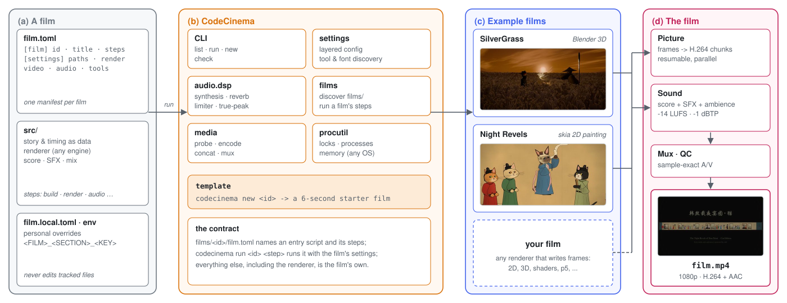

<div align="center">

# CodeCinema

<p><b>Make a complete short film with code: picture, music, sound, titles and the final master, regenerated by one command.</b></p>

[](https://zjucqr.github.io/CodeCinema/)
[](LICENSE)
[](https://www.python.org/)
[](https://ffmpeg.org/)
[](https://www.blender.org/)

**English** · [简体中文](README.zh-CN.md)


</div>

---

CodeCinema is a small framework for films that exist only as code. A film is a folder with a `film.toml` and its own pipeline. The framework adds the parts every film needs:
- **Settings:** one layered configuration per film, with local overrides and environment variables, plus discovery of tools and fonts.
- **Sound:** a shared audio toolkit for synthesis, physical models, reverb, true-peak limiting and loudness.
- **Assembly:** ffmpeg helpers that probe, encode, concatenate and mux.
- **Command line:** one CLI that lists films, runs their steps and starts new ones.

Two complete films come with it as examples, each made with a different technique.

## ✨ Highlights

- 🤖 **Films made by a coding agent.** Both example films were directed in plain language and built end to end by a coding agent: story, characters, animation, cameras, score, sound and mastering.
- 🎬 **Two complete example films.** *Duel in the Silver Grass* is a 160-second samurai duel rendered in Blender 3D. *The Night Revels of Han Xizai, Cat Edition* is a 128-second living handscroll painted in 2D with skia.
- 🧩 **A small contract, any renderer.** A film declares its steps in `film.toml`, and `codecinema run <film> <step>` runs them with that film's settings. Blender, 2D vector drawing, shaders or anything else that writes frames will fit.
- 🎼 **A shared sound toolkit.** The DSP library behind both scores is part of the framework: oscillators, plucked-string and modal models, convolution reverb, a true-peak limiter and loudness helpers.
- ♻️ **Reproducible and configurable.** Deterministic renders, resumable parallel jobs, layered settings that never require editing tracked files, and helpers that work on macOS, Linux and Windows.

## 🚀 Quick start

```bash
git clone https://github.com/ZJUCQR/CodeCinema.git && cd CodeCinema
python3 -m venv .venv && source .venv/bin/activate     # Windows: .venv\Scripts\activate
pip install .                                          # installs the `codecinema` command

codecinema check                      # Python packages, ffmpeg, and Blender for the 3D example
codecinema list                       # the films in films/ and their steps
codecinema run nightrevels all        # the 2D example: the whole film in a few minutes
codecinema run silvergrass all        # the 3D example: needs Blender 5.2+, a long render
codecinema new myfilm                 # start your own film from the template
```

Each film writes its finished video to its own `assets/film/` folder. `python -m codecinema …` works too, without installing the command.

## 🎞 Example films

<div align="center">

| <a href="films/silvergrass/README.md"></a> | <a href="films/nightrevels/README.md"></a> |
|:---:|:---:|
| **[Duel in the Silver Grass](films/silvergrass/README.md)** | **[The Night Revels of Han Xizai, Cat Edition](films/nightrevels/README.md)** |
| A masterless shinobi faces an old sword master in a sea of silver grass, through three acts: Blade, Fire and Thunder. | A night banquet painted on silk, where every guest is a cat and a kitten painter spies on them. |
| Blender 3D · 160 s · 30 shots | skia 2D painting · 128 s · 13 cat breeds |
| `codecinema run silvergrass all` | `codecinema run nightrevels all` |

</div>

Both films can be watched in full on the [homepage](https://zjucqr.github.io/CodeCinema/).

## 🎨 Make your own film

```bash
codecinema new myfilm --title "My Film"     # creates films/myfilm/ from the template
codecinema run myfilm all                    # renders a 6-second starter film
```

The template is a complete, tiny film: `draw_frame()` draws each frame, `score()` composes the sound, and the framework encodes and muxes them. Replace those two functions with your own film, add steps as it grows, and keep its settings in `film.toml`.

```toml
# films/myfilm/film.toml
[film]
id = "myfilm"
title = "My Film"
entry = "src/run.py"                    # the script that runs the film's steps
steps = ["render", "audio", "assemble", "all"]

[settings.video]
width = 1920
height = 1080
fps = 24
```

In the film's code, `from codecinema import settings, media` and `from codecinema.audio import dsp` provide the settings, ffmpeg helpers and the sound toolkit. The full guide is **[docs/FRAMEWORK.md](docs/FRAMEWORK.md)**.

## 🗂 Project layout

```
CodeCinema/
├── codecinema/             # the framework
│   ├── cli.py              # codecinema list | run | new | check
│   ├── settings.py         # layered per-film settings, tool and font discovery
│   ├── films.py            # film discovery and step running
│   ├── media.py            # ffmpeg: probe, encode, concat, mux
│   ├── procutil.py         # cross-platform locks, processes, memory
│   ├── audio/dsp.py        # the shared audio toolkit
│   └── template/           # the starter film used by `codecinema new`
├── films/
│   ├── silvergrass/        # example: Duel in the Silver Grass (Blender 3D)
│   └── nightrevels/        # example: The Night Revels of Han Xizai, Cat Edition (2D)
├── docs/                   # the framework guide
├── site/                   # the homepage
└── pyproject.toml          # the package and its dependencies
```

## 🧭 How it works

<div align="center">

</div>

<p align="center"><sub><b>Figure 1.</b> CodeCinema. <b>(a)</b> A film is a folder: <code>film.toml</code> names its steps and holds its settings, and <code>src/</code> holds its story, renderer and sound. <b>(b)</b> The framework runs a film's steps with that film's settings and lends it shared parts: layered settings, the audio toolkit, ffmpeg helpers, cross-platform process tools and a starter template. <b>(c)</b> The renderer belongs to the film, so the two examples use different engines, Blender 3D and skia 2D. <b>(d)</b> Every film ends the same way: encoded picture plus mastered sound, muxed sample-accurately into one file.</sub></p>

## 📜 License

Released under the [MIT License](LICENSE) © 2026 ZJUCQR.
