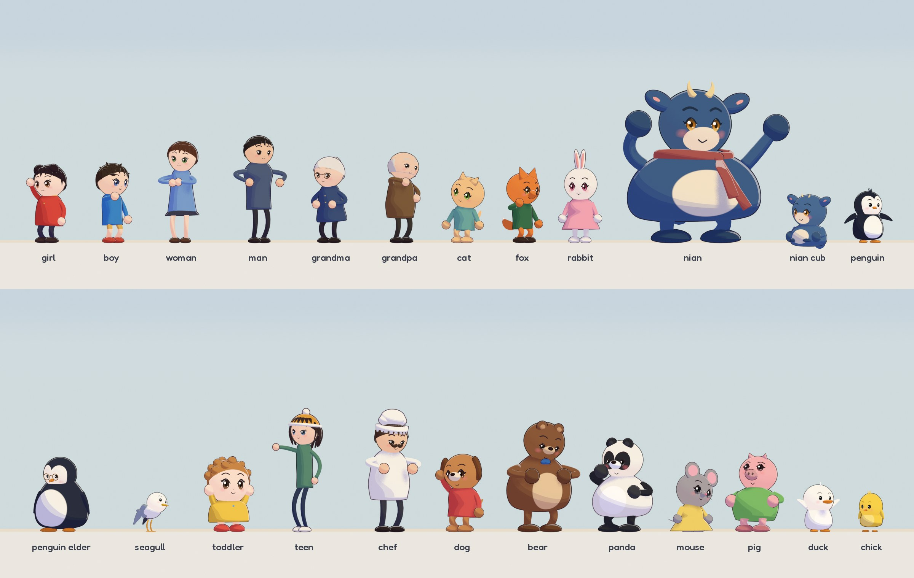

<h1 align="center">CodeCinema</h1>

<p align="center">
  <a href="https://zjucqr.github.io/CodeCinema/"><strong>Project page</strong></a> ·
  <a href="#quick-start"><strong>Quick start</strong></a> ·
  <a href="#cartoons">Cartoon films</a> ·
  <a href="#framework">Framework</a> ·
  <a href="README.zh-CN.md">简体中文</a>
</p>

<p align="center">
  <a href="https://github.com/ZJUCQR/CodeCinema/actions/workflows/ci.yml"></a>
  <a href="LICENSE"></a>
  <a href="#quick-start"></a>
  <a href="#quick-start"></a>
  <a href="#blender"></a>
</p>

<p align="center">
  <a href="https://zjucqr.github.io/CodeCinema/#films">
    
  </a>
</p>

---

CodeCinema is an extensible, open-source filmmaking framework for picture, music, sound and the final cut. Write your story in the local Studio, choose Skia or Blender, and turn your scenes into an MP4 with music and optional voices. Or write a screenplay for a 3D cartoon: cast characters from the library, pick sets and shot sizes, and CodeCinema animates, voices, scores and mixes the film.

Film folders hold story data. Media lives in the root `assets/<film-id>/` directory. The framework owns the renderers, characters, sound and assembly, so you can make a film without copying or writing production scripts. Developers can add rendering backends through plugins.

## ✨ Highlights

- 🎭 **Cartoon films from a screenplay.** 24 library characters, 7 sets, 13 times of day, 54 actions, 12 gaits and 28 expressions, with automatic framing, lip sync, Foley and subtitles.
- 🏃 **Motion with weight.** Anticipation and overshoot, follow-through on heads, ears, tails and flippers, squash and stretch, weight shifts, talking gestures and turns that step rather than swivel.
- 🪄 **From a look to a finished film.** Eight animated styles with editable text, colors, timing and camera moves, in landscape, portrait or square.
- 🎼 **A real sound library.** 113 instruments from a sampled orchestra to Chinese, Japanese and 8-bit voices, 27 music styles, 163 sound effects, 30 ambience beds and 20 cartoon voices, mixed to broadcast loudness.
- 🔤 **Type in any language.** 73 open-licensed font families for Latin, Chinese, Japanese, Korean, Arabic, Devanagari, Thai and Hebrew, with per-script fallback in mixed-language titles.
- 🧩 **Choose your renderer.** Switch between Skia 2D and Blender 3D, use your own Blender scenes, or install a renderer plugin.
- ♻️ **Made for iteration.** Reopen saved projects in Studio or run individual production steps from the command line.

<a id="quick-start"></a>

## 🚀 Quick start

You need **Python 3.12+**, Git and **FFmpeg**. Clone the repository, then expand the commands for your operating system:

```bash
git clone https://github.com/ZJUCQR/CodeCinema.git
cd CodeCinema
```

<details>
<summary>macOS</summary>

Install the tools with [Homebrew](https://brew.sh/), then create the environment:

```bash
brew install python@3.12 ffmpeg
python3.12 -m venv .venv
.venv/bin/python -m pip install -e .
.venv/bin/python -m codecinema studio
```

</details>

<details>
<summary>Linux</summary>

Install Python 3.12+ and FFmpeg with your distribution's package manager. On Ubuntu 24.04:

```bash
sudo apt-get install python3-venv ffmpeg fonts-dejavu-core libgl1 libegl1 libfontconfig1
python3 -m venv .venv
.venv/bin/python -m pip install -e .
.venv/bin/python -m codecinema studio
```

</details>

<details>
<summary>Windows</summary>

Install [Python 3.12+](https://www.python.org/downloads/) and FFmpeg, then run:

```powershell
winget install Gyan.FFmpeg
# Reopen PowerShell after installation, then return to CodeCinema.
py -3.12 -m venv .venv
.\.venv\Scripts\python.exe -m pip install -e .
.\.venv\Scripts\python.exe -m codecinema studio
```

</details>

These commands use the virtual environment directly. On Windows, replace `-3.12` if you installed a newer Python. Studio opens **http://127.0.0.1:8787/**. Keep the terminal running and press `Ctrl+C` to stop.

1. **Choose a look:** click a thumbnail to set the film’s starting style.
2. **Personalize:** enter a film ID, title and caption. Choose Skia or Blender, then set duration, frame and picture quality.
3. **Render my film:** watch or download the finished MP4.


## 🎞 Example films

<table width="100%">
  <tr>
    <td width="50%" valign="top">
      <a href="films/pebble/README.md"></a>
      <h3><a href="films/pebble/README.md">Pebble</a></h3>
      <p>A little penguin who cannot fly dives into the sea to save his friend, and finds that his sky was there all along.</p>
      <p><a href="https://zjucqr.github.io/CodeCinema/#pebble">Watch</a> · <a href="https://github.com/ZJUCQR/CodeCinema/releases/tag/pebble">Download</a> · <a href="films/pebble/README.md">Film guide</a></p>
    </td>
    <td width="50%" valign="top">
      <a href="films/nian/README.md"></a>
      <h3><a href="films/nian/README.md">Nian</a></h3>
      <p>On New Year's Eve a girl meets the legendary beast Nian, who wears the red scarf her grandmother gave him sixty winters ago.</p>
      <p><a href="https://zjucqr.github.io/CodeCinema/#nian">Watch</a> · <a href="https://github.com/ZJUCQR/CodeCinema/releases/tag/nian">Download</a> · <a href="films/nian/README.md">Film guide</a></p>
    </td>
  </tr>
  <tr>
    <td width="50%" valign="top">
      <a href="films/silvergrass/README.md"></a>
      <h3><a href="films/silvergrass/README.md">Duel in the Silver Grass</a></h3>
      <p>A masterless shinobi faces an old sword master in a sea of silver grass, through Blade, Fire and Thunder.</p>
      <p><a href="https://zjucqr.github.io/CodeCinema/#silvergrass">Watch</a> · <a href="https://github.com/ZJUCQR/CodeCinema/releases/tag/film">Download</a> · <a href="films/silvergrass/README.md">Film guide</a></p>
    </td>
    <td width="50%" valign="top">
      <a href="films/nightrevels/README.md"></a>
      <h3><a href="films/nightrevels/README.md">The Night Revels of Han Xizai, Cat Edition</a></h3>
      <p>A night banquet painted on silk, where every guest is a cat and a kitten painter spies on them.</p>
      <p><a href="https://zjucqr.github.io/CodeCinema/#nightrevels">Watch</a> · <a href="https://github.com/ZJUCQR/CodeCinema/releases/tag/nightrevels">Download</a> · <a href="films/nightrevels/README.md">Film guide</a></p>
    </td>
  </tr>
</table>

<a id="customization"></a>

## 🎨 Make your own film

Use Personalize every scene in Studio to shape each shot. Mix different looks within one film, then connect them through captions, pacing and camera movement.

| What to personalize | Available controls |
| --- | --- |
| Renderer | Skia for fast 2D films, Blender for 3D scenes, or an installed plugin |
| Words | Film title, opening caption and individual scene captions |
| Visual style | Moonrise, Sunset, Aurora, Neon, Ocean, Ink, Cosmos and Ember, with your own accent color |
| Scenes and pacing | Add, remove or reorder shots, adjust their length, and choose wide, drift or close camera moves |
| Video format | Landscape, portrait or square frames, with a choice of picture quality |

Reopen a project under My films to keep editing and rendering. The scene cards control captions, timing, looks and camera movement. They create scenic shorts, not automatic character acting from a prose prompt. For custom characters and animation, supply a Blender scene or extend a renderer.

Prefer the terminal? Run these commands from the repository root to create a film and change its visual backend. On Windows, use `.\.venv\Scripts\python.exe` in place of `.venv/bin/python`:

```bash
.venv/bin/python -m codecinema new myfilm --renderer skia --preset aurora --render
.venv/bin/python -m codecinema customize myfilm --renderer blender --render
```

Use `--story path/to/scenes.json` with `new` or `customize` to import a storyline. Explicit title, caption, duration and style options override the imported values. Scene data stays in `films/<id>/`, and media stays in `assets/<id>/`. Backend choices and production settings stay in the root `pyproject.toml`.

<a id="cartoons"></a>

## 🎭 Cartoon films

A cartoon film is a screenplay: a cast chosen from the character library, sets from the set library, and scenes made of shots. Each shot names a camera and lists timed beats. Install [Blender 5.2 or later](https://www.blender.org/download/), then start from the example screenplay:

```bash
.venv/bin/python -m codecinema new myshort --template cartoon
.venv/bin/python -m codecinema run myshort all
```

Edit `films/myshort/screenplay.json`. A shot reads like a shooting script:

```json
{"id": "wave", "dur": 5.0, "camera": {"size": "medium", "on": ["mei"], "move": "push"},
 "do": [{"t": 0.4, "who": "mei", "act": "wave", "dur": 2.2},
        {"t": 0.6, "who": "mei", "say": "Hello! Welcome to the meadow.", "mood": "happy"},
        {"t": 3.2, "who": "mei", "face": "joy"}]}
```

| A beat can | Example |
| --- | --- |
| Move a character | `{"who": "mei", "walk": "gate"}`, also `run`, `sneak`, `tiptoe`, `hop`, `waddle`, `fly`, `swim` |
| Act and emote | `{"who": "mei", "act": "cheer", "dur": 2}`, `{"who": "mei", "face": "teary"}`, `{"who": "mei", "look": "pip"}` |
| Speak | `{"who": "mei", "say": "...", "mood": "tender", "zh": "..."}`, or a wordless `{"vocal": "giggle"}` |
| Use props and effects | `{"prop": "lantern", "hold": "mei"}`, `{"fx": "fireworks", "at": [0, 30], "dur": 8}` |
| Add sound | `{"sfx": "splash_big", "at": "shore"}`; footsteps are added automatically |

Cameras take a size (`extreme_wide` to `extreme_close`), a side or bearing, an angle and a move (`push`, `pull`, `orbit_left`, `crane_up`, `follow`, `handheld` and more). The camera frames its subjects and steps around trees, houses and bystanders. Scenes carry a set, a time of day, an ambience bed and a music cue in one of the styles. Themes are written in note names, such as `"D5/q B4/e G4/e A4/h"`.

Browse the libraries from the terminal, or render the character library as a picture:

```bash
.venv/bin/python -m codecinema library
.venv/bin/python -m codecinema library actions
.venv/bin/python -m codecinema library --sheet characters.png
```



Characters are assembled from shared parts: six body shapes, a dozen hair styles, seven hats, accessories such as glasses, a scarf, a moustache or a backpack, and animal ears, snouts and tails. Override any of them in the cast, for example `{"from": "dog", "shape": "slim", "accessories": [{"kind": "hat", "style": "straw"}]}`.

An action only names the pose it aims for; the motion layer adds the craft. Characters wind up before a gesture and overshoot a little after it, hair, ears, tails and flippers trail behind and swing past, bodies squash on landing and lean into a run, speakers nod and gesture with their voice, and paths round their corners. Steps never go faster than a gait allows, so feet stay planted instead of skating.

Work in steps: `plan` checks the screenplay and warns about lines that overlap and moves too fast for their gait, `stills` renders one frame per shot as a storyboard, and `render --preview` renders a half-size pass. `--frames 12s,40s` renders single moments. Rendering uses EEVEE by default. On a machine without a GPU, set `engine = "cycles"` under the film's `settings.render` in `pyproject.toml`; Cycles is slower and shades more softly.

<a id="framework"></a>

## 🧩 Framework

The framework separates film content from production code:

- **Content:** scene order, captions, narration, timing and assets belong to each film.
- **Production:** a shared scene clock connects planning, rendered frames, music, speech, assembly and quality checks.
- **Renderers:** Skia and Blender turn scenes into frames through the same interface. Installed plugins appear in `codecinema renderers` and Studio.
- **Cartoons:** [codecinema/cartoon](codecinema/cartoon) compiles screenplays, animates library characters, directs the camera and drives Blender. Characters, sets, props, actions and expressions are data that a screenplay can override.
- **Sound:** [codecinema/audio](codecinema/audio) holds the instruments, composer, sound effects, ambience, cartoon voices, speech and the mixer shared by every film.
- **Production packs:** the two authored examples retain their authored character designs, choreography and sound in [codecinema/productions](codecinema/productions). Their film folders contain story data, with media in `assets/<id>/`.

The examples use specialized production packs and keep their existing commands. Their choreography cannot be switched automatically between backends. New Studio projects use the shared pipeline and can change renderer without moving their content. Existing projects with custom entry scripts remain runnable.

See [CONTRIBUTING.md](CONTRIBUTING.md#renderer-plugins) for the small renderer interface and plugin registration.

<a id="blender"></a>

## 🎬 Blender

Install [Blender 5.2 or later](https://www.blender.org/download/), then choose **Blender · 3D** in Studio or pass `--renderer blender`. The built-in worlds provide lit scenery and moving cameras. The same scene timeline places captions, music and optional narration.

To use your own characters or animation, save a `.blend` file under `assets/<film-id>/`, for example `assets/<film-id>/scenes/world.blend`. On its scene card, expand Blender scene and enter `scenes/world.blend` and an optional camera name. Paths are relative to that film’s asset directory. Pack external resources in Blender so the project can move between computers. Your scene animation is sampled using its own frame rate.

Start with Quick preview or a few still frames. Blender rendering takes longer than Skia and depends on scene complexity, resolution and hardware. The [Duel in the Silver Grass guide](films/silvergrass/README.md) demonstrates a more elaborate authored production.

<a id="speech"></a>

## 🎙️ Voices

In Studio, expand Add a voice on a scene card to write dialogue, choose a voice and describe its mood, such as “warm and curious” or “nervous but composed.” Allow enough time for each line and listen to a sample before producing a longer film. Leave the text empty for music only.

Speech works on every platform. CodeCinema uses, in order: a recording you supply, a local expressive voice when installed, the system voice (macOS `say`, Windows SAPI, or `espeak-ng` on Linux), and finally cartoon babble, which needs nothing installed. On an Apple Silicon Mac, install the expressive speech pack from the repository root, then restart Studio:

```bash
.venv/bin/python -m pip install -e ".[speech]"
```

The first spoken render downloads the voice model. Cartoon characters can also get a voice designed from a description. For recorded speech, put a WAV file in `assets/<film-id>/voices/` and set the scene’s `narration.recording` filename and `narration.text` in `scenes.json`. Cartoon films store their takes with `run <film> voices --keep-voices`, so a film made on one computer sounds the same on any other.

<a id="fonts"></a>

## 🔤 Fonts

Titles, credits and captions can use any of 73 open-licensed families. Fredoka and ZCOOL KuaiLe ship with CodeCinema; the others download on first use from a pinned commit of the Google Fonts repository, verified by SHA-256 and stored with their licenses.

```bash
.venv/bin/python -m codecinema library fonts                 # families by script, license and status
.venv/bin/python -m codecinema library fonts --download ja   # prefetch for offline work
.venv/bin/python -m codecinema library fonts --sheet fonts.png
```

Choose fonts by name in a screenplay, `"fonts": {"title": "Lilita One", "credits": "Nunito"}`, or for any film under `[fonts]` in its settings. Mixed-language text falls back per run on one baseline, and Arabic, Hebrew, Devanagari and Thai are shaped on every platform. Set `CODECINEMA_FONTS_MIRROR` when GitHub is slow to reach, or `CODECINEMA_OFFLINE=1` to stay offline.

<a id="sound"></a>

## 🎼 Sound

The score is written as data and played by a sampled orchestra: CodeCinema plays the General MIDI sound bank [GeneralUser GS](https://www.schristiancollins.com/generaluser.php) by S. Christian Collins with its own SoundFont player. The bank, 32 MB, downloads once on first use. Offline, or with `CODECINEMA_AUDIO_SOUNDBANK=off`, the score uses the built-in synthesized instruments. `codecinema library instruments`, `styles`, `sounds`, `ambience` and `voices` list what is available: 113 instruments, 27 styles from lullaby to jazz swing, chiptune and Japanese, 163 effects with Doppler passes and footsteps on a dozen surfaces, 30 ambience beds and 20 cartoon voices with 39 wordless sounds. Every film is mixed with dialogue ducking and mastered to its loudness target.

## 🗂 Project layout

The framework and film content have separate homes. Use this map to find the part you want to change:

```text
CodeCinema/
├── codecinema/               # shared framework and local Studio
│   ├── __init__.py             # package version and public convenience imports
│   ├── __main__.py             # python -m codecinema entry point
│   ├── cli/                    # command-line interface
│   │   └── app.py              # commands, arguments and dispatch
│   ├── workspace/              # film content and project management
│   │   ├── paths.py            # workspace and package locations
│   │   ├── registry.py         # film registration and atomic configuration edits
│   │   ├── settings.py         # layered settings, tools and fonts
│   │   ├── films.py            # film discovery and worker launch
│   │   ├── projects.py         # creation, customization and backups
│   │   └── story.py            # scene validation, looks and formats
│   ├── engine/                 # shared production pipeline
│   │   ├── context.py          # validated timeline and render context
│   │   ├── pipeline.py         # planning, picture, sound, assembly and QC
│   │   └── worker.py           # isolated execution for each film
│   ├── runtime/                # external tools and process support
│   │   ├── blender.py          # Blender launch and shared scene helpers
│   │   ├── media.py            # FFmpeg encoding, probing and muxing
│   │   ├── process.py          # processes, locks and memory helpers
│   │   └── diagnostics.py      # dependency checks and setup hints
│   ├── studio/                 # local visual editor
│   │   ├── server.py           # HTTP API and media delivery
│   │   └── jobs.py             # project state and background render jobs
│   ├── renderers/              # Skia, Blender and renderer plugin interface
│   ├── cartoon/                # screenplay films: libraries, motion, camera, voices, finishing
│   │   └── blender/            # characters, sets, props and effects built in Blender
│   ├── audio/                  # instruments, composer, sound effects, ambience, voices and mixer
│   ├── typography/             # font catalog, script detection, fallback and text drawing
│   └── productions/            # authored example production packs
│       ├── silvergrass/        # choreography, Blender scenes and post-production
│       └── nightrevels/        # painted characters, scroll animation and music
├── films/                    # story data and generated working files
│   ├── pebble/               # Pebble (cartoon screenplay)
│   ├── nian/                 # Nian (cartoon screenplay)
│   ├── silvergrass/          # Duel in the Silver Grass
│   └── nightrevels/          # The Night Revels of Han Xizai, Cat Edition
├── assets/                   # all media, grouped by film
│   ├── pebble/               # Pebble artwork and voice recordings
│   ├── nian/                 # Nian artwork and voice recordings
│   ├── silvergrass/          # Duel in the Silver Grass media
│   ├── nightrevels/          # The Night Revels media
│   └── _shared/              # resources shared by the framework and website
│       ├── images/           # branding and README illustrations
│       ├── fonts/            # open-licensed display fonts for titles
│       ├── studio/           # editor interface and look thumbnails
│       ├── scaffold/         # starting files for new films
│       └── site/             # website styles, scripts and preview media
├── pyproject.toml            # dependencies and all film configurations
├── CONTRIBUTING.md           # development and contribution guidance
└── LICENSE                   # MIT license
```

Each film uses `assets/<id>/images/` for illustrations and `assets/<id>/film/` for finished videos. Add `voices/`, `scenes/`, `models/`, `textures/` or `fonts/` there when needed. Generated working files remain in `films/<id>/out/`. In configuration, paths beginning with `assets/` are relative to the workspace root. Other relative paths start at the film folder.

## 🧭 How it works


1. **Shape the story:** arrange shots, content and pacing.
2. **Make the picture:** the chosen renderer builds scenes, animation and camera movement.
3. **Create the sound:** place music, ambience, effects and optional voices against the shots.
4. **Finish the film:** align picture and sound, then encode a playable MP4.

## Contributing

Improvements to looks, Studio, renderers, libraries and documentation are welcome. Read [CONTRIBUTING.md](CONTRIBUTING.md) for development setup and checks. Use [GitHub Issues](https://github.com/ZJUCQR/CodeCinema/issues) for bugs and feature ideas, and include a screenshot or short clip when discussing a visual change.

## 📜 License

Released under the [MIT License](LICENSE) © 2026 ZJUCQR.
