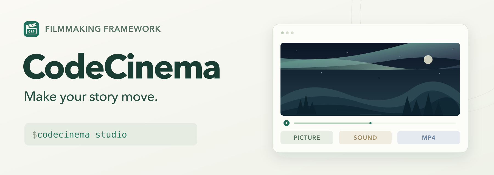
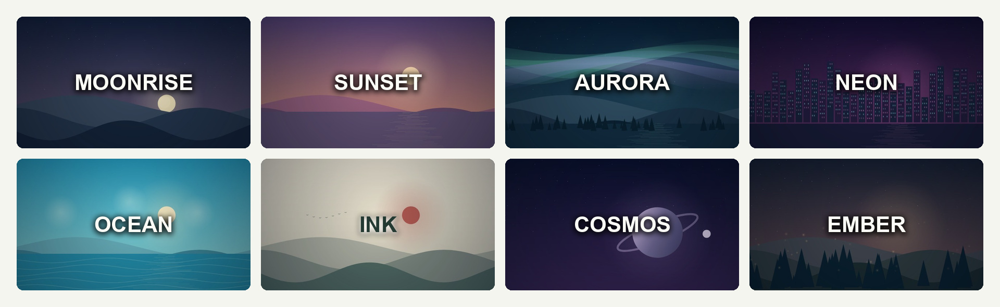
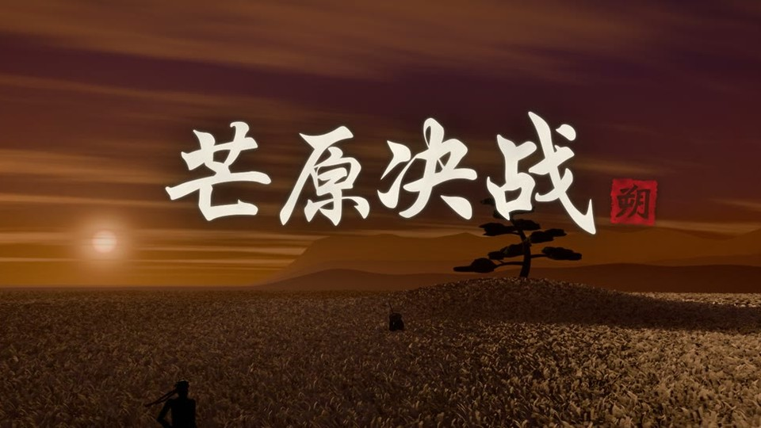
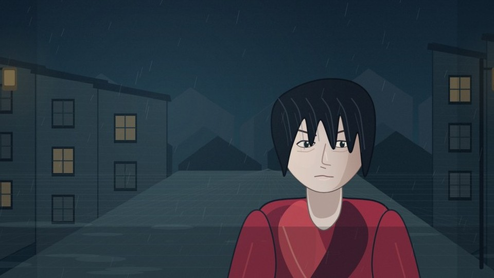
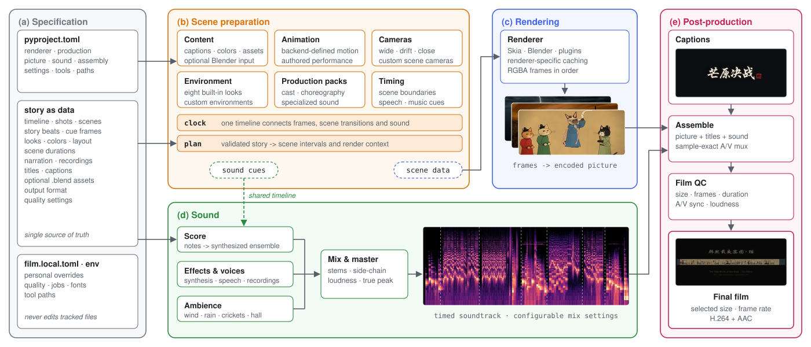

<h1 align="center">CodeCinema</h1>

<p align="center">
  <a href="https://zjucqr.github.io/CodeCinema/zh/"><strong>项目主页</strong></a> ·
  <a href="#quick-start"><strong>快速开始</strong></a> ·
  <a href="#framework">框架概览</a> ·
  <a href="README.md">English</a>
</p>

<p align="center">
  <a href="https://github.com/ZJUCQR/CodeCinema/actions/workflows/ci.yml"></a>
  <a href="LICENSE"></a>
  <a href="#quick-start"></a>
  <a href="#quick-start"></a>
  <a href="#blender"></a>
</p>

<p align="center">
  <a href="https://zjucqr.github.io/CodeCinema/zh/#films">
    
  </a>
</p>

---

CodeCinema 是可扩展的开源影片制作框架，将画面、音乐、声音与最终剪辑连接起来。在本地 Studio 中编排故事，选择 Skia 或 Blender，为镜头添加文字、配乐和可选配音，再生成 MP4。

影片文件夹保存故事数据，媒体素材统一放在根目录 `assets/<影片 ID>/`。框架统一提供渲染器、声音和合成流程，无需复制或编写制作脚本。开发者可以通过插件扩展渲染技术。

## ✨ 亮点

- 🪄 **从场景到成片**：八种动态风格，可调整文字、配色、时长与镜头。
- 🎨 **自由选择画幅**：支持横屏、竖屏和方形视频。
- 🎼 **画面与声音一起制作**：生成配乐和音效，也可加入配音与录音。
- 🧩 **选择渲染技术**：切换 Skia 2D 与 Blender 3D，使用自己的 Blender 场景，也可安装渲染插件。
- 💻 **本地运行**：支持 macOS、Linux 和 Windows，基础出片无需 API Key。
- ♻️ **持续修改与迭代**：在 Studio 中重新打开作品，也可通过命令行分步运行制作流程。

<a id="quick-start"></a>

## 🚀 快速开始

需要 **Python 3.12+、Git 和 FFmpeg**。先克隆仓库，然后展开对应系统的安装命令：

```bash
git clone https://github.com/ZJUCQR/CodeCinema.git
cd CodeCinema
```

<details>
<summary>macOS</summary>

使用 [Homebrew](https://brew.sh/) 安装工具并创建环境：

```bash
brew install python@3.12 ffmpeg
python3.12 -m venv .venv
.venv/bin/python -m pip install -e .
.venv/bin/python -m codecinema studio
```

</details>

<details>
<summary>Linux</summary>

使用发行版的包管理器安装 Python 3.12+ 与 FFmpeg。以下命令适用于 Ubuntu 24.04：

```bash
sudo apt-get install python3-venv ffmpeg fonts-dejavu-core libgl1 libegl1 libfontconfig1
python3 -m venv .venv
.venv/bin/python -m pip install -e .
.venv/bin/python -m codecinema studio
```

</details>

<details>
<summary>Windows</summary>

先安装 [Python 3.12+](https://www.python.org/downloads/)，然后运行：

```powershell
winget install Gyan.FFmpeg
# 安装后重新打开 PowerShell，再回到 CodeCinema 目录。
py -3.12 -m venv .venv
.\.venv\Scripts\python.exe -m pip install -e .
.\.venv\Scripts\python.exe -m codecinema studio
```

</details>

这些命令直接使用虚拟环境，无需激活。Windows 使用更新的 Python 时，将 `-3.12` 替换为对应版本。Studio 自动打开 **http://127.0.0.1:8787/**。使用期间保持终端运行，按 `Ctrl+C` 退出。

1. **选场景**：点击缩略图，选择影片的初始风格。
2. **改内容**：填写影片 ID、标题和字幕，选择 Skia 或 Blender，再设置时长、画幅与画质。
3. **生成影片**：点击“生成我的影片”，完成后直接观看或下载 MP4。



## 🎞 示例影片

<table width="100%">
  <tr>
    <td width="50%" valign="top">
      <a href="films/silvergrass/README.zh-CN.md"></a>
      <h3><a href="films/silvergrass/README.zh-CN.md">芒原决战</a></h3>
      <p>落日芒草原上，无主之忍对决年迈的剑豪，分为剑、焰、雷三幕。</p>
      <p><a href="https://zjucqr.github.io/CodeCinema/zh/#silvergrass">观看</a> · <a href="https://github.com/ZJUCQR/CodeCinema/releases/tag/film">下载</a> · <a href="films/silvergrass/README.zh-CN.md">制作指南</a></p>
    </td>
    <td width="50%" valign="top">
      <a href="films/nightrevels/README.zh-CN.md"></a>
      <h3><a href="films/nightrevels/README.zh-CN.md">韩熙载夜宴图 · 猫</a></h3>
      <p>一场画在绢上的夜宴，每位宾客都是猫，还有一只小猫画师在偷偷作画。</p>
      <p><a href="https://zjucqr.github.io/CodeCinema/zh/#nightrevels">观看</a> · <a href="https://github.com/ZJUCQR/CodeCinema/releases/tag/nightrevels">下载</a> · <a href="films/nightrevels/README.zh-CN.md">制作指南</a></p>
    </td>
  </tr>
  <tr>
    <td width="50%" valign="top">
      <a href="films/xishen/README.zh-CN.md"></a>
      <h3><a href="films/xishen/README.zh-CN.md">我不是戏神</a></h3>
      <p>从陈伶雨夜归家、剧院噩梦到第一次编导演练。</p>
      <p><a href="https://zjucqr.github.io/CodeCinema/zh/#xishen">观看</a> · <a href="https://github.com/ZJUCQR/CodeCinema/releases/tag/xishen">下载</a> · <a href="films/xishen/README.zh-CN.md">制作指南</a></p>
    </td>
  </tr>
</table>

<a id="customization"></a>

## 🎨 制作自己的影片

在 Studio 的“逐个定制分镜”中调整每个镜头。可以在同一部影片里搭配不同场景，再通过字幕、节奏和镜头运动组织故事。

| 定制内容 | 可调整的选项 |
| --- | --- |
| 渲染技术 | Skia 快速生成二维画面，Blender 生成三维场景，也可使用已安装的插件 |
| 文字 | 影片标题、开场字幕和每个镜头的字幕 |
| 视觉风格 | 月升、日落、极光、霓虹、海洋、水墨、宇宙与余烬，可自行选择点缀色 |
| 分镜与节奏 | 增删或排序镜头，调整时长，选择全景、缓慢移动或推进 |
| 视频画幅 | 横屏、竖屏或方形，选择适合用途的画质 |

从“我的影片”重新打开项目，即可继续编辑。分镜卡片控制字幕、时长、风格与镜头运动，生成场景短片。它不会自动把一段小说转换成人物表演。自定义人物与动作可通过 Blender 场景或渲染器扩展接入。

也可以在仓库根目录运行以下命令，新建影片后切换渲染技术。Windows 下将 `.venv/bin/python` 换成 `.\.venv\Scripts\python.exe`：

```bash
.venv/bin/python -m codecinema new myfilm --renderer skia --preset aurora --render
.venv/bin/python -m codecinema customize myfilm --renderer blender --render
```

在 `new` 或 `customize` 后添加 `--story path/to/scenes.json` 可导入自己的分镜。显式指定的标题、字幕、时长和风格选项会覆盖导入值。剧情保存在 `films/<id>/`，素材保存在 `assets/<id>/`，渲染器和制作设置统一保存在根目录 `pyproject.toml`。

<a id="framework"></a>

## 🧩 框架概览

框架将影片内容与制作代码分开管理：

- **内容：** 镜头顺序、字幕、台词、时长和素材属于各部影片。
- **制作流程：** 统一的分镜时钟连接规划、画面、配乐、配音、合成与成片检查。
- **渲染器：** Skia 与 Blender 通过同一接口输出画面。已安装的插件会显示在 `codecinema renderers` 和 Studio 中。
- **制作包：** 三部示例的角色造型、动作和配乐实现集中在 [codecinema/productions](codecinema/productions)，影片目录只保留故事数据，素材放在 `assets/<id>/`。

示例影片保留原有制作命令，并使用专门设计的制作包。它们的动作编排无法自动切换到另一种后端。新建 Studio 项目使用共享管线，可以直接更换渲染器。以前带有自定义入口脚本的项目仍可运行。

开发扩展请参阅 [CONTRIBUTING.md](CONTRIBUTING.md#renderer-plugins) 中的渲染器接口与插件注册方式。

<a id="blender"></a>

## 🎬 Blender

安装 [Blender 5.2 或更新版本](https://www.blender.org/download/)，在 Studio 选择 **Blender · 3D**，或使用 `--renderer blender`。内置三维场景提供灯光与运动镜头，并与字幕、配乐和可选配音共用时间轴。

要使用自己的角色和动画，将 `.blend` 文件放入 `assets/<影片 ID>/`，例如 `assets/<影片 ID>/scenes/world.blend`。在分镜卡片中展开“Blender 场景”，填写 `scenes/world.blend` 和可选的摄像机名称，路径相对于该影片的素材目录。建议在 Blender 中打包外部素材，便于跨电脑使用。框架会按场景原有帧率读取动画。

先用快速预览或少量静帧检查构图。Blender 渲染比 Skia 更慢，耗时取决于场景复杂度、分辨率与硬件。[《芒原决战》说明](films/silvergrass/README.zh-CN.md) 展示了更完整的人物与镜头制作。

<a id="speech"></a>

## 🎙️ 配音

在 Studio 的分镜卡片中展开“添加配音”，填写台词、选择声音并描述情绪，例如“温柔而好奇”或“紧张但克制”。为台词留足时长，制作较长影片前先试听声音。台词留空时生成配乐版。

Apple Silicon Mac 可在仓库根目录安装本地情绪语音包，然后重启 Studio：

```bash
.venv/bin/python -m pip install -e ".[speech]"
```

首次配音会下载语音模型，后续制作可复用已有配音，无需 API Key。使用录音时，将 WAV 文件放入 `assets/<影片 ID>/voices/`，并在 `scenes.json` 对应分镜中设置 `narration.recording` 文件名与 `narration.text` 台词。各平台均可使用录音。

## 🗂 项目结构

框架与影片内容分开组织，便于找到需要修改的部分：

```text
CodeCinema/
├── codecinema/               # 共享框架与本地 Studio
│   ├── __init__.py             # 包版本与公共便捷导入
│   ├── __main__.py             # python -m codecinema 启动入口
│   ├── cli/                    # 命令行接口
│   │   └── app.py              # 命令、参数与调度
│   ├── workspace/              # 影片内容与项目管理
│   │   ├── paths.py            # 工作区与框架资源路径
│   │   ├── registry.py         # 影片注册与原子配置修改
│   │   ├── settings.py         # 分层配置、工具与字体查找
│   │   ├── films.py            # 影片发现与制作进程启动
│   │   ├── projects.py         # 创建、定制与备份
│   │   └── story.py            # 分镜校验、风格与画幅
│   ├── engine/                 # 共享制作管线
│   │   ├── context.py          # 分镜时间轴与渲染上下文
│   │   ├── pipeline.py         # 规划、画面、声音、合成与质检
│   │   └── worker.py           # 各部影片的隔离执行
│   ├── runtime/                # 外部工具与进程支持
│   │   ├── blender.py          # Blender 启动与共用场景工具
│   │   ├── media.py            # FFmpeg 编码、探测与合成
│   │   ├── process.py          # 进程、锁与内存工具
│   │   └── diagnostics.py      # 依赖检查与安装提示
│   ├── studio/                 # 本地可视化编辑器
│   │   ├── server.py           # HTTP 接口与媒体响应
│   │   └── jobs.py             # 项目状态与后台制作任务
│   ├── renderers/              # Skia、Blender 与渲染插件接口
│   ├── audio/                  # 配乐、音效、配音与表演时序
│   └── productions/            # 示例影片的制作包
│       ├── silvergrass/        # 动作、Blender 场景与后期
│       ├── nightrevels/        # 角色绘制、长卷动画与音乐
│       └── xishen/             # 角色、表演、配音与多集合成
├── films/                    # 故事数据与生成的工作文件
│   ├── silvergrass/          # 《芒原决战》
│   ├── nightrevels/          # 《韩熙载夜宴图 · 猫》
│   └── xishen/               # 《我不是戏神》
├── assets/                   # 全部媒体素材，按影片归类
│   ├── silvergrass/          # 芒原决战的素材
│   ├── nightrevels/          # 韩熙载夜宴图的素材
│   ├── xishen/               # 剧集配图、录音与 MP4 成片
│   └── _shared/              # 框架与网站的公共资源
│       ├── images/           # 品牌图与 README 配图
│       ├── studio/           # 编辑器界面与风格缩略图
│       ├── scaffold/         # 新影片的初始文件
│       └── site/             # 网站样式、脚本与预览媒体
├── pyproject.toml            # 依赖与所有影片配置
├── CONTRIBUTING.md           # 开发与贡献说明
└── LICENSE                   # MIT 许可证
```

每部影片使用 `assets/<id>/images/` 保存配图，使用 `assets/<id>/film/` 保存成片。需要时可在同一目录添加 `voices/`、`scenes/`、`models/`、`textures/` 或 `fonts/`。生成的中间文件仍放在 `films/<id>/out/`。配置中以 `assets/` 开头的路径相对于工作区根目录，其他相对路径以影片文件夹为起点。

## 🧭 工作原理



1. **组织故事**：确定镜头顺序、内容与节奏。
2. **制作画面**：由所选渲染器生成场景、动画与摄影机运动。
3. **制作声音**：为镜头安排配乐、环境声、音效与可选配音。
4. **完成影片**：对齐画面和声音，编码输出可播放的 MP4。

## 参与贡献

欢迎改进场景、Studio、渲染器和文档。请先阅读[贡献指南](CONTRIBUTING.md)，了解开发环境与验证方式。提出问题或功能建议时，请在 [GitHub Issues](https://github.com/ZJUCQR/CodeCinema/issues) 中描述使用场景，涉及视觉修改时可附上截图或短片。

## 📜 许可

本项目以 [MIT 许可证](LICENSE) 发布 © 2026 ZJUCQR。
