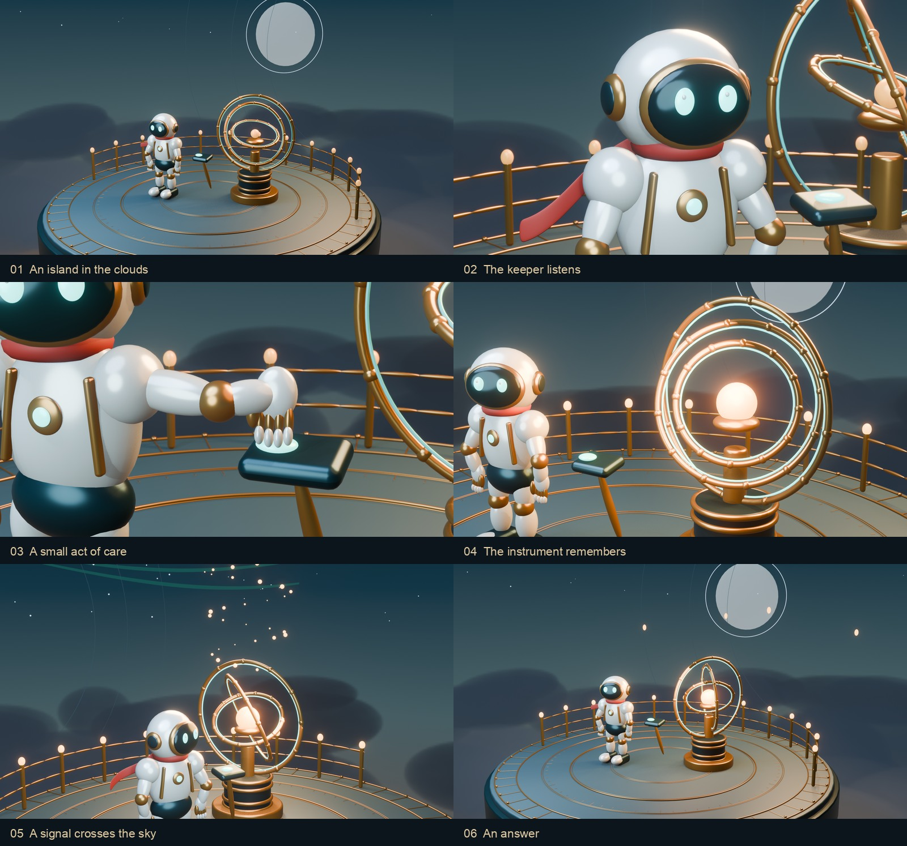

# The Last Beacon

A wordless Blender short about a small act of care, an ancient instrument and a light that answers from afar.

[Watch the film](https://zjucqr.github.io/CodeCinema/#beacon) · [Download MP4](https://github.com/ZJUCQR/CodeCinema/releases/tag/beacon) · [Chinese](README.zh-CN.md)


**48 seconds · 1920 × 1080 · 24 fps · stereo · Blender 5.2+**

The keeper is an original porcelain-and-brass automaton, with layered armor, separate fingers, luminous inset eyes and a wind-responsive scarf. Six connected shots move from solitude to attention, ignition and an answer. Every shot uses the same character and continuous performance clock. An original synthesized score combines piano-like notes, bowed harmonics and glass bells with wind, servo movement and contact sounds.

## Render in one command

Install the framework using the [setup guide](../../README.md#quick-start), plus [Blender 5.2 or newer](https://www.blender.org/download/). From the repository root:

```bash
codecinema run beacon all
```

The finished film appears at `films/beacon/assets/film/TheLastBeacon.mp4`. No API key, downloaded model, texture pack or Blender add-on is needed. Blender and FFmpeg are detected automatically. Set `BLENDER_BIN`, `FFMPEG` or `FFPROBE` if they are installed elsewhere. Allow time for 1,152 full-resolution 3D frames. Speed depends on the GPU.

On a machine with sufficient GPU memory, `codecinema run beacon all --jobs 2` runs two non-overlapping frame ranges concurrently. Start with the default single process on smaller GPUs. Production commands are locked to prevent two invocations from overwriting the same film.

For a quick look before the full render:

```bash
codecinema run beacon check
codecinema run beacon still                 # six representative 960 × 540 frames
codecinema run beacon still 481 --full      # full-resolution contact moment
```

Preview images go to `films/beacon/out/stills/`. They never replace master frames.

## Personalize

Create `films/beacon/film.local.toml` to override the look without changing tracked files:

```toml
[render]
samples_final = 64           # cleaner edges; longer render
exposure = -0.2              # slightly brighter than the published edition

[art]
porcelain = [0.72, 0.79, 0.75]
brass = [0.52, 0.28, 0.085]
scarf = [0.06, 0.20, 0.30]  # linear RGB: a blue scarf
```

Run `codecinema run beacon all` again. The renderer resumes an interrupted edition and automatically invalidates cached frames when scene code, story data or supported visual settings change. To deliberately rebuild unchanged frames, use `codecinema run beacon all --force`.

| Change | File |
| --- | --- |
| Shot descriptions and shared action/audio cue times | [src/story.py](src/story.py) |
| Character geometry, camera positions, materials, lighting and performance | [src/scene.py](src/scene.py) |
| Harmony, melody, instruments and effects | [src/sound.py](src/sound.py) |
| Encoding and delivery checks | [src/run.py](src/run.py) |

The six-shot structure and 48-second composition are authored together. Changing total runtime requires retiming the cameras, gestures and score, not just changing the duration constant.

## Production steps

```bash
codecinema run beacon render
codecinema run beacon audio
codecinema run beacon assemble
```

`out/audio/` contains separate music, ambience and effects stems, the stereo mix and its loudness report. `out/qc.json` records the final video probe, full-decode result and measured AAC loudness/true peak. Assembly checks all frames, requires exactly 1,152 decoded video frames and 48 seconds, and rejects an encoded audio peak above −1 dBTP. The mix targets −16 LUFS with headroom for AAC.



See the [Blender setup](../../README.md#blender) to get started. The images and film are rendered from the included scene code. This is a stylized animated production.

Author: **ZJUCQR**. Code and original procedural assets: [MIT](../../LICENSE).
