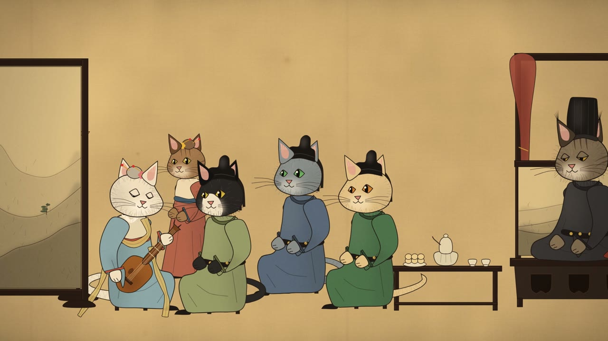
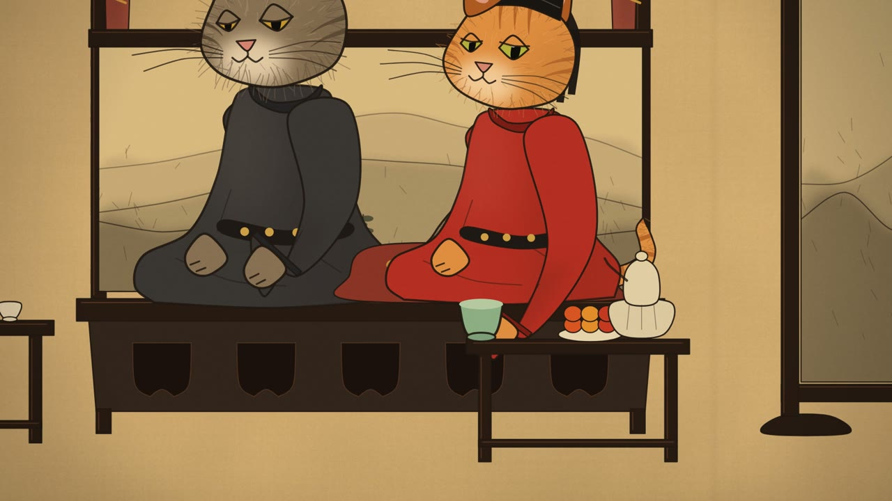
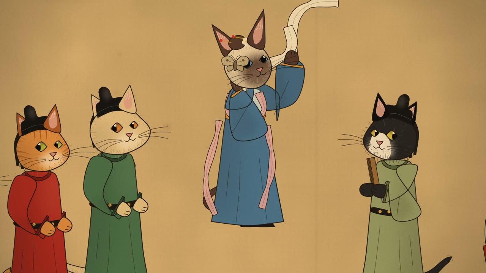
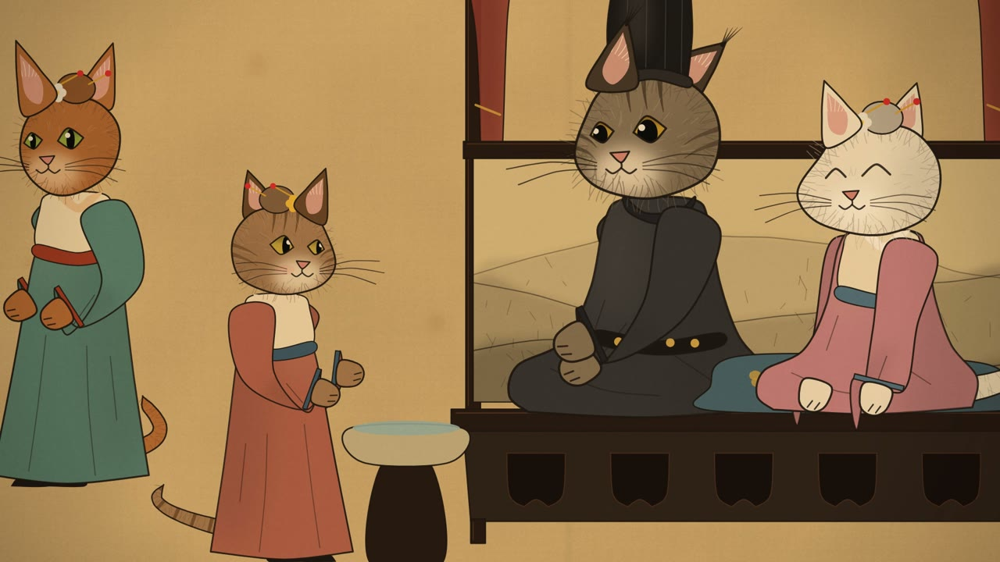
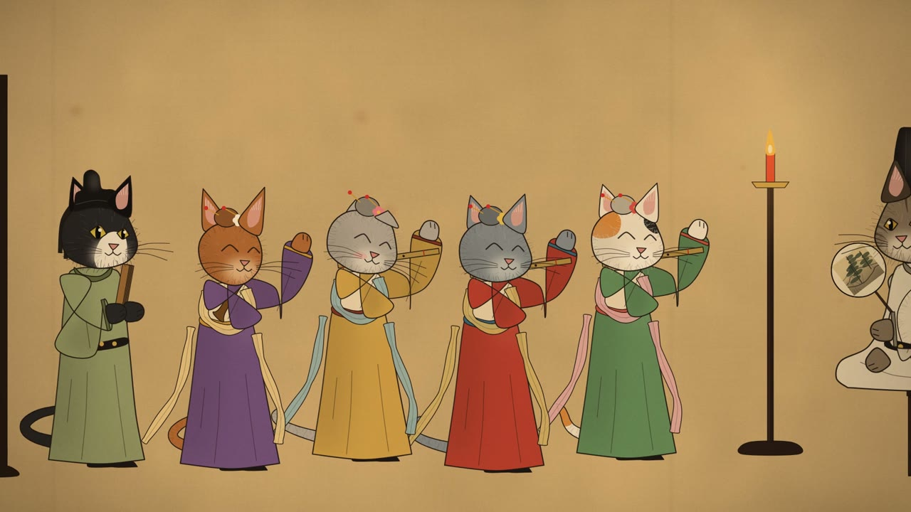
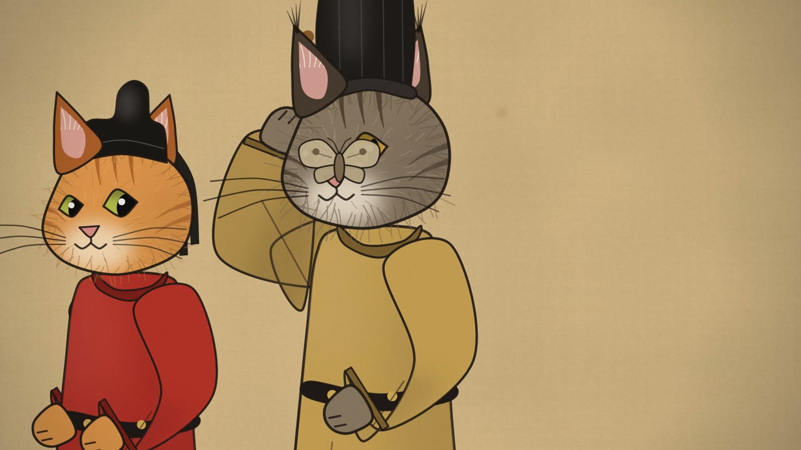
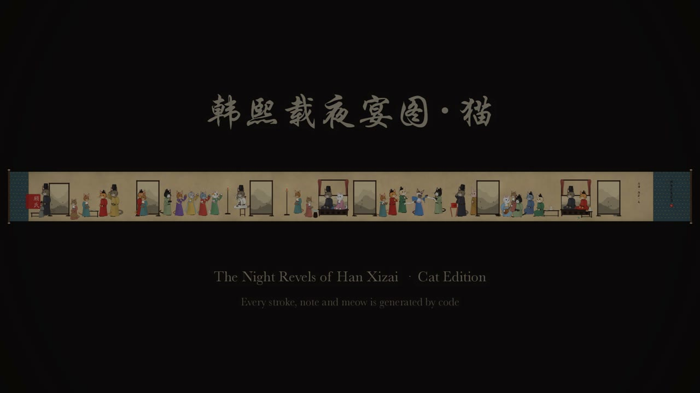

<div align="center">

# Night Revels · 韩熙载夜宴图 · 猫

<p><sub>用 <a href="../../README.zh-CN.md"><b>CodeCinema</b></a> 制作的示例影片</sub></p>

<p><b>《韩熙载夜宴图 · 猫》是一部 128 秒的“活”长卷：名画里的每一个人物，都换成了猫。</b></p>

[](https://zjucqr.github.io/CodeCinema/zh/)
[](../../LICENSE)
[](https://www.python.org/)
[](https://kyamagu.github.io/skia-python/)
[](https://ffmpeg.org/)

[English](README.md) · **简体中文**



</div>

---

**南唐的一场夜宴，画在绢上，而每一位宾客都是猫。** 皇帝派来的画师是一只小虎斑猫，他从一扇屏风躲到另一扇屏风，偷偷画下韩熙载的夜宴。满堂的猫穿着华丽的唐代服饰，举止优雅，直到猫的本能把它们出卖。

镜头像展开手卷一样，沿一幅长卷从右向左移动，经过原作的五段：听乐、观舞、暂歇、清吹、散宴。每一段进入画面时便活了过来。
- **画面**：工笔风格（细劲的墨线、矿物颜料、毛发丝毛），用 skia 绘制成 2D 矢量木偶，画在程序生成的绢上。
- **声音**：原创五声调式配乐，由琵琶、羯鼓、拍板、笛、筚篥和古琴演奏，外加合成的猫叫、呼噜和音效。

## ✨ 亮点

- 🤖 **由 coding agent 创作**：用自然语言导演，由 coding agent 规划故事、设计猫咪、编写渲染器、制作每一场动画并创作配乐。
- 🐈 **十三个品种，一幅名画**：缅因猫主人、橘猫捣蛋鬼、波斯猫琵琶手、暹罗猫舞者、无毛猫和尚等等。每只猫都会眨眼、动耳朵、呼吸、摇尾巴。
- 🎭 **猫的本能就是剧情**：推下桌的酒杯、打断舞蹈的飞蛾、拒绝洗手的主人、吹破音的笛子、根本塞不下的篮子，还有一位早就知道画师存在的主人。
- 🎼 **音乐带动爪子**：配乐先写成音符数据，琵琶手的拨弦、鼓手的击鼓、拍板的开合都落在准确的音符上，每个笑点和它的声音误差不超过一帧。
- ⚡ **迭代很快**：每帧渲染不到一秒；整部影片的画面约 90 秒渲染完成，声音约 10 秒。

## 🚀 快速开始

```bash
git clone https://github.com/ZJUCQR/CodeCinema.git && cd CodeCinema
python3 -m venv .venv && source .venv/bin/activate     # Windows: .venv\Scripts\activate
pip install .                                          # 安装框架和全部依赖

codecinema run nightrevels all      # 构建 → 渲染 → 音频 → 合成
```

成片输出到 `assets/film/`。下表每个命令都是影片的一个步骤：在仓库任意位置运行 `codecinema run nightrevels <步骤>`，或在 `films/nightrevels/` 目录里运行 `python src/run.py <步骤>`。

| 命令 | 作用 |
|---|---|
| `build` | 写出音效事件表和乐谱（音符数据） |
| `still F[,F…]` | 渲染单帧到 `out/stills/` |
| `render [--force] [--jobs N]` | 并行渲染画面，分块进行、可续渲 |
| `audio` | 合成配乐、猫的声音、音效和环境声，然后混音和母带处理 |
| `assemble` | 把画面和声音合成为成片 |
| `all` | 从头到尾跑完整条流程 |

## 🖼 画廊

<div align="center">

| | |
|:---:|:---:|
|  |  |
| **听乐**：酒杯被推到桌边 | **观舞**：飞蛾，和那一扑 |
|  |  |
| **暂歇**：水？不用了，谢谢 | **清吹**：破音之后 |
|  |  |
| **散宴**：飞蛾落下 | **整幅长卷** |

</div>

## 🎨 个性化定制

故事由数据和代码组成。时间轴和提示点在 `src/common/config.py`，乐谱在 `src/common/music.py`，角色在 `src/story/cast.py`，动作和镜头在 `src/story/film.py`。机器相关的设置（输出、并行数、编码、响度）在根目录 `pyproject.toml` 的 `[tool.codecinema.films.nightrevels.settings]` 里。

| 想改什么 | 改哪里 |
|---|---|
| 故事节拍和时间 | config 里的 `CUE` 和 `SECTIONS` |
| 音乐（旋律、速度、由哪件乐器演奏） | `music.py`；演奏的爪子会自动跟随音符 |
| 猫的品种、毛色、眼睛、服装 | `cast.py` 里的 `BREEDS` 和服装 |
| 谁站在哪里、动作、笑点、镜头 | `film.py`（角色的关键帧轨道和 `Camera` 关键帧） |
| 画风（墨线、绢、面部、家具） | `src/paint/` |
| 并行数、画质、响度 | 根目录 `pyproject.toml` 的 `[tool.codecinema.films.nightrevels.settings]` |

你可以自己创建相应的配置，或者覆盖已有设置：

```toml
# film.local.toml
[render]
jobs = 4
crf = 12
```

```bash
NIGHTREVELS_RENDER_JOBS=2 codecinema run nightrevels render
```

## 🗂 项目结构

```
films/nightrevels/
├── src/
│   ├── run.py              # 影片的各个步骤
│   ├── common/             # 时间轴和布局（config）、乐谱音符数据（music）
│   ├── paint/              # 工笔绘制：墨线、绢、猫头、袍袖、道具
│   ├── story/              # 角色、动画轨道、舞台渲染器、整部影片（film.py）
│   └── audio/              # 乐器、猫的声音、音效、环境声、配乐、混音
└── assets/                 # README 图片
```

## 🧭 工作原理

1. **先有乐谱**：`music.py` 把每个音符写成数据，动作编排读取同一份音符，所以拨弦、击鼓、拍板都踩在拍子上。
2. **长卷上的角色**：每只猫和每件道具都是一个角色，有带关键帧的轨道（位置、视线、耳朵、嘴、爪子），再加上自动的待机动作。镜头同样用关键帧控制，在一幅长宽比约 14:1 的绢上滑动。
3. **画出来，而不是渲染出来**：每一帧都用 2D 绘制，依次是绢、装裱、家具、按远近排序的角色木偶、烛光和夜色、暗角和纤维颗粒。
4. **动作即声音**：动作会发出带时间的事件（碰杯声、猫的啁啾、呼噜、破音……），音频引擎把它们按采样精度放在渲染好的配乐旁边。
5. **快速、可续渲**：画面并行渲染并直接编码成视频分块，声音几秒钟就能合成并做好母带（-14 LUFS）。


## 📜 许可

本项目以 [MIT 许可证](../../LICENSE) 发布 © 2026 ZJUCQR。
