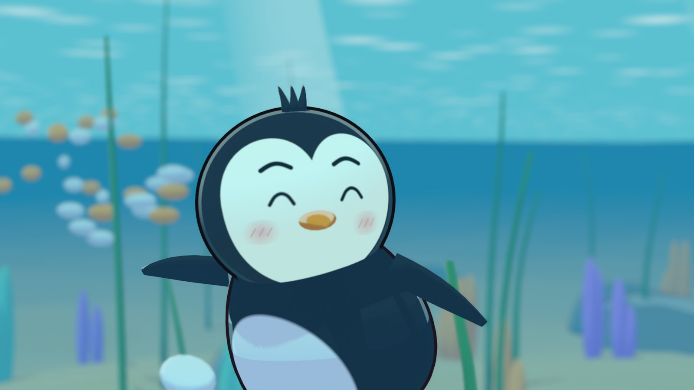

<div align="center">

# 小企鹅飞起来

<p><sub>用 <a href="../../README.zh-CN.md"><b>CodeCinema</b></a> 制作的示例影片</sub></p>

<p><b>一只有大梦想的小企鹅：一部用一份剧本写成的三分钟英语 3D 动画短片。</b></p>

[](https://zjucqr.github.io/CodeCinema/zh/#pebble)
[](../../LICENSE)
[](https://www.python.org/)
[](https://www.blender.org/)
[](https://ffmpeg.org/)

[English](README.md) · **简体中文**



</div>

---

**小企鹅 Pebble 想飞。** 每天早上，他都爬上礁石拼命扇动翅膀，然后一头栽进沙子里，海鸥朋友 Skye 在天上笑他。树叶翅膀、棕榈叶滑翔、原地狂扇到头晕，结局都一样。日落时，爷爷告诉他：你的翅膀没有错，也许你的天空并不在你以为的地方。

第二天，Skye 俯冲抓鱼时被旧渔网缠住，沉进了海里。Pebble 从悬崖上一跃而下去救他。到了水下，那双“没用”的翅膀让他像鸟一样飞了起来。

- **画面：** 角色库里的角色（老少两只企鹅、两只企鹅宝宝和两只海鸥），在海滩与水下场景中用 Blender 卡通渲染，带描边。
- **声音：** 一段手写主题，编配成俏皮、追逐、温情、冒险、惊奇与凯旋等段落；英语对白、咯咯笑声、拟音脚步、水花和海浪。

## ✨ 亮点

- 🤖 **由 coding agent 制作。** 用自然语言指挥：coding agent 写了故事、剧本、主题旋律和每一个镜头。
- 🎭 **一份剧本，一部电影。** 约 40 个镜头，由 `{"who": "pebble", "waddle": "shore"}` 这样的动作节拍组成。CodeCinema 负责走路、扇翅、俯冲和表情动画，自动构图并安排声音。
- 🌊 **两个世界。** 清晨、正午、日落、黄昏的阳光海滩，以及有海藻、珊瑚、鱼群和光束的水下海湾。
- 🎼 **真正的乐团。** 尤克里里、钟琴、拨弦、竖琴、弦乐、铜管和合唱来自 General MIDI 音色库，混音到 −16 LUFS，对白时音乐自动避让。
- 🗣 **各平台声音一致。** 英语对白以小体积录音保存在 `assets/pebble/voices/`，无需语音模型也能得到同样的声音。

## 🚀 快速开始

按照[安装说明](../../README.zh-CN.md#quick-start)安装框架，再安装 [Blender 5.2 或更高版本](https://www.blender.org/download/)。在仓库根目录运行；Windows 请把 `.venv/bin/python` 换成 `.\.venv\Scripts\python.exe`。

```bash
.venv/bin/python -m codecinema run pebble all
```

成片位于 `assets/pebble/film/Pebble.mp4`，带可选的英文字幕轨。首次制作声音时会下载一次 32 MB 的 General MIDI 音色库；没有网络时，配乐改用内置的合成乐器。

## 🎬 改成你的故事

所有内容都在 [`screenplay.json`](screenplay.json)：角色、场景、音乐主题和每个镜头。一个镜头写明机位，再列出带时间的动作：

```json
{"id": "today", "dur": 4.0, "camera": {"size": "close", "on": ["pebble"], "side": "front_left"},
 "do": [{"t": 0.2, "who": "pebble", "face": "determined"},
        {"t": 0.4, "who": "pebble", "say": "Today's the day, Skye. I can feel it!", "mood": "determined"}]}
```

建议分步检查：

```bash
.venv/bin/python -m codecinema run pebble plan               # 检查剧本与时间线
.venv/bin/python -m codecinema run pebble stills             # 每个镜头一帧，生成分镜表
.venv/bin/python -m codecinema run pebble render --preview   # 快速渲染半尺寸全片
.venv/bin/python -m codecinema run pebble render --frames 12s,40s   # 或只渲染几个时刻
.venv/bin/python -m codecinema run pebble voices             # 重新生成改过的台词
.venv/bin/python -m codecinema run pebble audio              # 配乐、对白、拟音与环境声
.venv/bin/python -m codecinema run pebble assemble           # 片头、字幕与 MP4
```

运行 `codecinema library` 可以浏览镜头能用到的角色、场景、动作、表情、音效、乐器和音乐风格。

## 📜 致谢

故事、剧本、调度与配乐由 coding agent 借助 CodeCinema 完成。乐器采样来自 S. Christian Collins 的 [GeneralUser GS](https://www.schristiancollins.com/generaluser.php)。片名字体为 Fredoka（SIL 开源字体许可）。以 [MIT 许可](../../LICENSE)发布。
