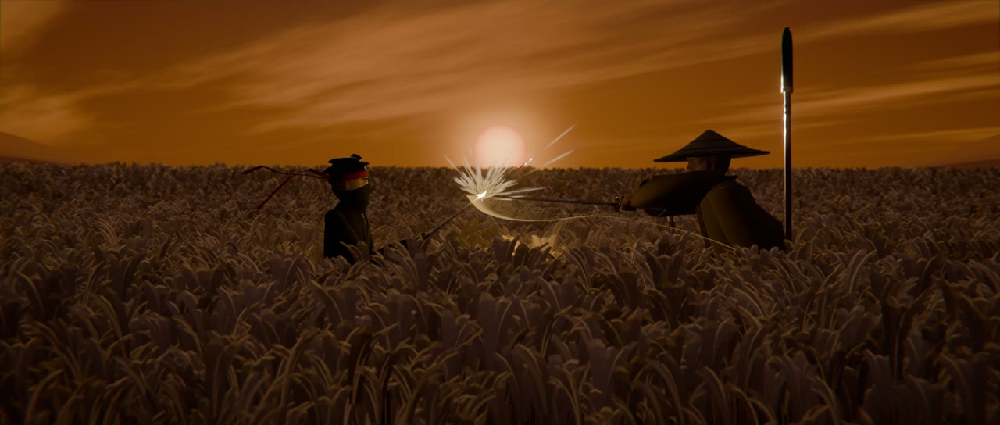
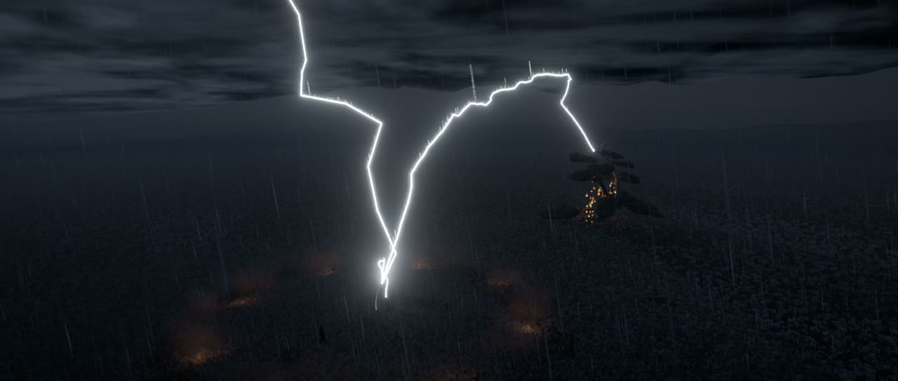
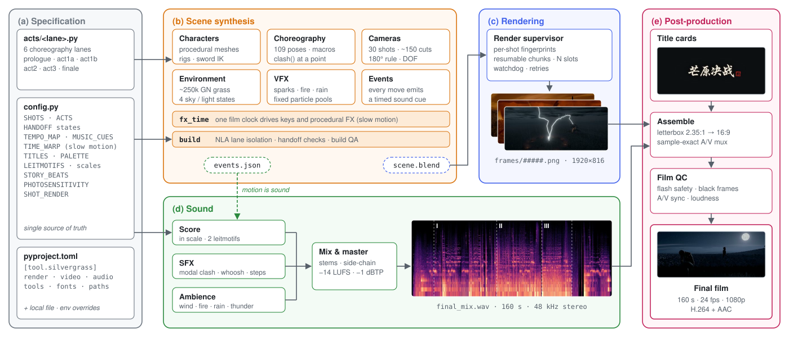

<div align="center">

# SilverGrass

<p><sub>An example film made with <a href="../../README.md"><b>CodeCinema</b></a></sub></p>

<p><i>For a swordsman, a whole life goes to meet a single instant.</i></p>

<p><b><i>Duel in the Silver Grass</i>: a 160-second animated samurai duel in which every frame, cut and note is generated by code.</b></p>

[](https://zjucqr.github.io/CodeCinema/)
[](../../LICENSE)
[](https://www.blender.org/)
[](https://www.python.org/)
[](https://ffmpeg.org/)
[](#-how-it-works)

**English** · [简体中文](README.zh-CN.md)


</div>

---

**Sunset. A sea of silver grass. A masterless shinobi, Saku, faces the old sword master Tenkosai.** The duel escalates over three acts, *Blade*, *Fire* and *Thunder*, and ends in a single instant.

The repository contains no hand-made assets. Everything is generated by code:
- **Picture:** characters, rigs, animation, cameras and VFX are Python running inside Blender.
- **Sound:** the score and every sound effect are synthesized with numpy and scipy.
- **Titles:** the calligraphic title cards are drawn with Pillow.
- **Master:** ffmpeg assembles and masters the film.

One command regenerates the whole film. Change a number and you get a different one.

## ✨ Highlights

- 🤖 **Made by a coding agent.** The film was directed in plain language and built by a coding agent. It planned the shots, wrote every line of code, choreographed the fight, composed the score and checked the result.
- 🎬 **A complete film with no hand-made assets.** 160 s, 30 shots and about 150 cuts, obeying the 180° rule, with slow-motion windows and a photosensitivity-safe flash budget. Characters, rigs, about 250k blades of grass, four sky states and every VFX are generated by code.
- 🥋 **Choreography as code.** A library of 109 poses and move macros (`slash`, `deflect`, `jump`, `spear_thrust`, …). `clash()` makes two blades meet at a chosen point in the world. Sparks, fire, lightning and rain are bake-free particle pools driven by a single film clock.
- 🎼 **Motion is sound.** An original score in the Japanese *in* scale is synthesized from scratch: taiko, shakuhachi, koto, shamisen, choir, temple bell. Every move emits a timed event, and those events place the sound effects and the musical accents on the exact frame.
- ♻️ **Reproducible and hackable.** One command regenerates the whole film. Per-shot fingerprints re-render only what changed, and every number, from story beats to render quality, can be edited.

## 🚀 Quick start

Follow the [setup guide](../../README.md#quick-start) to install the framework and FFmpeg. Also install [Blender 5.2 or newer](https://www.blender.org/download/). Run the commands below from the repository root. On Windows, use `.\.venv\Scripts\python.exe` in place of `.venv/bin/python`.

```bash
.venv/bin/python -m codecinema run silvergrass check     # finds Blender 5.2+, ffmpeg and the title fonts, and reports anything missing
.venv/bin/python -m codecinema run silvergrass all       # build → render → audio → titles → assemble
```

The finished film is written to `films/silvergrass/assets/film/芒原决战_Final.mp4`. The full render is the slow step, and you can stop it at any time: running the command again picks up where it left off. To look at one act in a few minutes, run `.venv/bin/python -m codecinema run silvergrass preview act2`.

Each command below is a step of the film: `.venv/bin/python -m codecinema run silvergrass <step>` from the repository root.

| Command | What it does |
|---|---|
| `check` | Check the toolchain, the Python packages and the fonts |
| `build [--lanes all] [--quality final\|preview\|layout]` | Build the scene and its event list |
| `preview <lane>` | Build and render one act at low resolution. Lanes: `prologue`, `act1a`, `act1b`, `act2`, `act3`, `finale` |
| `render [--shots S15-S20] [--slots N]` | Final render. Resumable, and re-renders only shots whose content changed |
| `audio` | Synthesize the score, SFX and ambience from the event list, then mix and master |
| `titles` | Render the calligraphic title cards |
| `assemble [--preview] [--range A B]` | Mux frames, titles and audio into the film, then run the film QC |
| `all` | Run the whole pipeline end to end |

## 🖼 Gallery

<div align="center">

| | |
|:---:|:---:|
|  |  |
| **Title card** | **Act I · Blade:** the first clash |
|  |  |
| The perfect deflect: the hat is cut in two | **Act II · Fire:** spear against sword in the ring |
|  |  |
| **Act III · Thunder:** the lightning cut | **Epilogue:** moonrise |

</div>

## 🎨 Customize

This folder contains no production scripts. [story.json](story.json) stores the authored shot data. Character, animation and sound code lives in the [framework production pack](../../codecinema/productions/silvergrass). Changes to authored shot timing require a matching review of choreography and sound.

The film is data plus code, so every part of it can be changed. Authored shots and act boundaries live in `story.json`. The production pack's `common/config.py` reads that data and supplies the style and choreography parameters. Machine and quality settings live in the root `pyproject.toml` under `[tool.codecinema.films.silvergrass.settings]`.

| To change… | Edit |
|---|---|
| Titles, epigraph, name and act cards | `TITLES` in config |
| Shot lengths, acts, tempo, slow motion, music cues | `shots` and `acts` in `story.json`, with `TEMPO_MAP`, `TIME_WARP` and `MUSIC_CUES` in the production config |
| Character colours and proportions | `PALETTE`, `SHINOBI_HEIGHT`, `SAINT_HEIGHT` in config. Character modules for the designs |
| Choreography and cameras of one act | That act's module in `codecinema/productions/silvergrass/blender/acts/` |
| Sky, light, wind, grass, VFX | `environment.*` and `vfx.*` calls from a lane |
| Melodies, scales, instruments | `LEITMOTIFS`, `SCALE_IN`, `SCALE_YO` in config. Score and instrument modules |
| Resolution, samples, motion blur, encoding, loudness | `[tool.codecinema.films.silvergrass.settings]` in the root `pyproject.toml` |

Override settings for this film in `films/silvergrass/film.local.toml`:

```toml
# film.local.toml
[render]
samples_final = 32        # cleaner, slower
slots = 1

[fonts]
calligraphy = "~/fonts/ZhiMangXing-Regular.ttf"
```

For a one-off override on macOS or Linux:

```bash
SILVERGRASS_VIDEO_CRF=18 BLENDER_BIN=/path/to/blender .venv/bin/python -m codecinema run silvergrass all
```

## 🗂 Project layout

```text
films/silvergrass/
├── story.json              # story, shots and shared timing cues
├── assets/                 # input assets, illustrations and generated masters
└── out/                    # generated working files and quality reports
```

## 🧭 How it works

<div align="center">

</div>

<p align="center"><sub>The SilverGrass pipeline. <b>(a)</b> The film is specified as data: shots and acts in <code>story.json</code>, handoff states, beat grid, cues and motifs in the production pack’s <code>common/config.py</code>, plus six choreography lanes. <b>(b)</b> Inside Blender, each lane keys characters, cameras and VFX within its own frame span. The build isolates the lanes in NLA strips and checks the states at every handoff. One film clock, <code>fx_time</code>, keeps procedural effects in step with slow motion. <b>(c)</b> A supervisor renders per-shot chunks and re-renders a shot only when its content fingerprint changes. <b>(d)</b> Every move emits a timed event, and the events place the SFX and the score's accents on the exact frame. <b>(e)</b> Title cards, frames and the mastered mix are assembled sample-accurately and checked for flash safety, A/V sync and loudness.</sub></p>


## 📜 License

Released under the [MIT License](../../LICENSE) © 2026 ZJUCQR.
