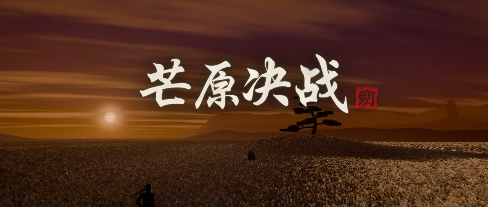
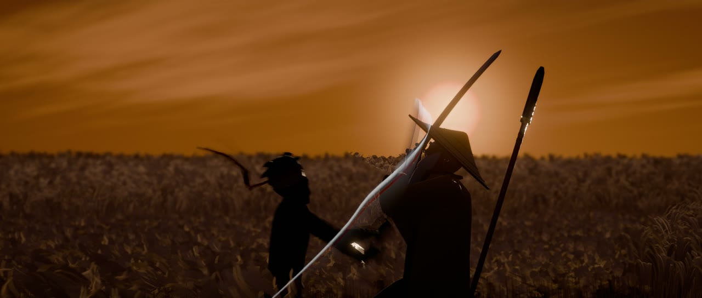
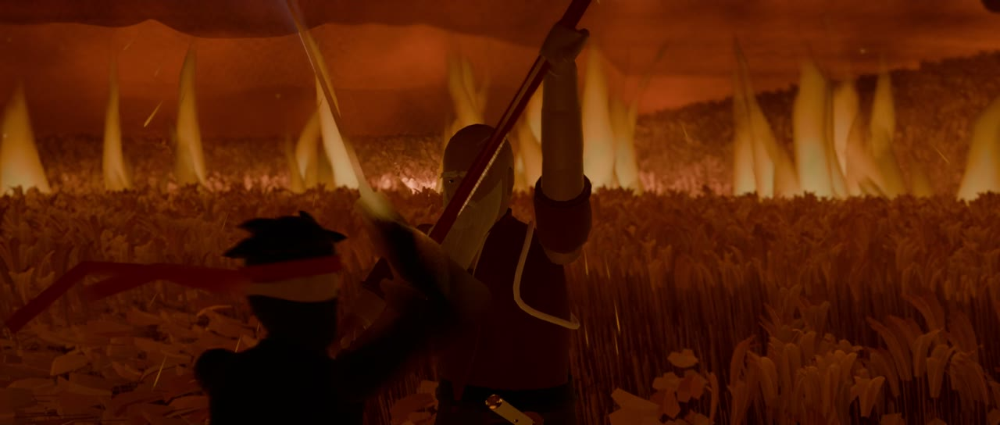
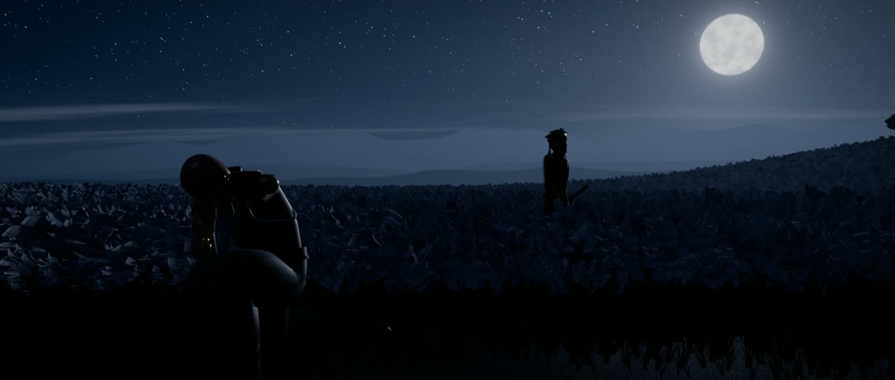
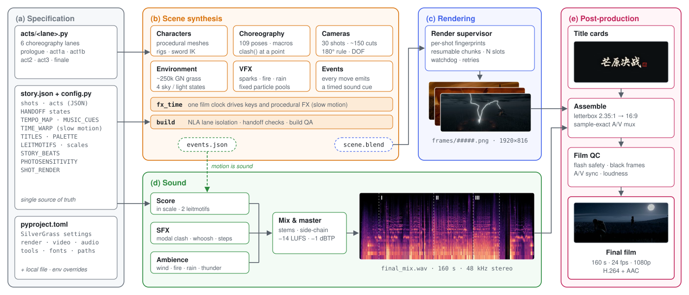

<div align="center">

# SilverGrass · 芒原决战

<p><sub>用 <a href="../../README.zh-CN.md"><b>CodeCinema</b></a> 制作的示例影片</sub></p>

<p><b>剑者，以一生赴一瞬。</b><br><i>For a swordsman, a whole life goes to meet a single instant.</i></p>

**《芒原决战》是一部 160 秒的武士决斗动画，每一帧、每一次剪辑、每一个音符都由代码生成。**

[](https://zjucqr.github.io/CodeCinema/)
[](../../LICENSE)
[](https://www.blender.org/)
[](https://www.python.org/)
[](https://ffmpeg.org/)
[](#-工作原理)

[English](README.md) · **简体中文**


</div>

---

**落日，芒草原。无主之忍朔，对上年迈的剑豪天鼓斋。** 决斗分三幕层层升级：剑、焰、雷，最后胜负只在一瞬之间。

仓库里没有一件手工制作的素材，全部由代码生成：
- **画面**：角色、绑定、动画、镜头和特效，都是在 Blender 里运行的 Python。
- **声音**：配乐和每一个音效都用 numpy 和 scipy 合成。
- **字幕**：书法字幕卡用 Pillow 绘制。
- **成片**：由 ffmpeg 合成并做母带处理。

一条命令就能重新生成整部影片。改一个数字，就是另一部电影。

## ✨ 亮点

- 🤖 **由 coding agent 创作**：用自然语言导演，由 coding agent 完成：规划分镜、编写全部代码、编排打斗、创作配乐，并检查成片。
- 🎬 **完整影片，零手工素材**：160 秒、30 个镜头、约 150 次剪辑，遵守 180° 轴线规则，设有慢镜头窗口，闪光控制在光敏安全预算以内。角色、骨架、约 25 万丛芒草、四种天空状态和全部特效都由代码生成。
- 🥋 **代码即编舞**：109 个姿势，加上 `slash`、`deflect`、`jump`、`spear_thrust` 等动作宏。`clash()` 让两把刀在世界空间的指定位置相交。火花、火焰、闪电和雨都是免烘焙的粒子池，由同一个影片时钟驱动。
- 🎼 **动作即声音**：原创配乐基于日本都节音阶，从零合成太鼓、尺八、筝、三味线、合唱和寺钟。每个动作都会发出带时间的事件，音效和配乐重音按事件落在准确的帧上。
- ♻️ **可复现，可改造**：一条命令重新生成整部影片。镜头级内容指纹只重渲改动的部分。从故事节拍到渲染画质，每个数字都可以改。

## 🚀 快速开始

先按[安装教程](../../README.zh-CN.md#quick-start)配置框架和 FFmpeg。另外安装 [Blender 5.2 或更新版本](https://www.blender.org/download/)。以下命令在仓库根目录运行。Windows 下将 `.venv/bin/python` 换成 `.\.venv\Scripts\python.exe`。

```bash
.venv/bin/python -m codecinema run silvergrass check     # 查找 Blender 5.2+、ffmpeg 和字幕字体，并报告缺少的部分
.venv/bin/python -m codecinema run silvergrass all       # 构建 → 渲染 → 音频 → 字幕 → 合成
```

成片输出到 `assets/silvergrass/film/芒原决战_Final.mp4`。完整渲染是最慢的一步，可以随时中断，再次运行会从中断处继续。想花几分钟先看某一幕，可以运行 `.venv/bin/python -m codecinema run silvergrass preview act2`。

下表每个命令都是影片的一个步骤：在仓库根目录运行 `.venv/bin/python -m codecinema run silvergrass <步骤>`。

| 命令 | 作用 |
|---|---|
| `check` | 检查工具链、Python 依赖和字体 |
| `build [--lanes all] [--quality final\|preview\|layout]` | 构建场景和事件表 |
| `preview <lane>` | 构建某一幕并以低分辨率渲染。可选：`prologue`、`act1a`、`act1b`、`act2`、`act3`、`finale` |
| `render [--shots S15-S20] [--slots N]` | 正式渲染，可断点续渲，只重渲内容变动过的镜头 |
| `audio` | 按事件表合成配乐、音效和环境声，然后混音和母带处理 |
| `titles` | 渲染书法字幕卡 |
| `assemble [--preview] [--range A B]` | 把画面、字幕和音频合成为成片，然后做成片质检 |
| `all` | 从头到尾跑完整条流程 |

## 🖼 画廊

<div align="center">

| | |
|:---:|:---:|
|  |  |
| **片名** | **一之幕 · 剑**：第一次弹刀 |
|  |  |
| 完美弹反，斗笠被一刀两断 | **二之幕 · 焰**：火环中的枪与刀 |
|  |  |
| **三之幕 · 雷**：雷切 | **终**：月出 |

</div>

## 🎨 个性化定制

本目录不包含制作脚本。分镜与提示点保存在 [story.json](story.json)，制作代码统一位于 [框架制作包](../../codecinema/productions/silvergrass)。修改已编排镜头的时间时，需要同步检查动作与配乐。

影片由数据和代码组成，每一部分都可以修改。分镜与幕的边界保存在 `story.json`。制作包的 `common/config.py` 读取这些数据，并提供风格与动作所需的其他参数。机器和画质相关的设置在根目录 `pyproject.toml` 的 `[tool.codecinema.films.silvergrass.settings]` 里。

| 想改什么 | 改哪里 |
|---|---|
| 片名、题记、名牌、幕名 | config 里的 `TITLES` |
| 镜头长度、分幕、节奏、慢镜头、配乐提示点 | `story.json` 中的 `shots`、`acts`，以及制作配置中的 `TEMPO_MAP`、`TIME_WARP`、`MUSIC_CUES` |
| 角色配色和比例 | config 里的 `PALETTE`、`SHINOBI_HEIGHT`、`SAINT_HEIGHT`。造型在角色模块里 |
| 某一幕的动作和镜头 | `codecinema/productions/silvergrass/blender/acts/` 中对应幕的模块 |
| 天空、光照、风、芒草、特效 | 在编舞线里调用 `environment.*` 和 `vfx.*` |
| 旋律、调式、乐器 | config 里的 `LEITMOTIFS`、`SCALE_IN`、`SCALE_YO`。编曲和乐器模块 |
| 分辨率、采样数、运动模糊、编码、响度 | 根目录 `pyproject.toml` 的 `[tool.codecinema.films.silvergrass.settings]` |

在 `films/silvergrass/film.local.toml` 中覆盖当前影片的设置：

```toml
# film.local.toml
[render]
samples_final = 32        # 更干净，也更慢
slots = 1

[fonts]
calligraphy = "~/fonts/ZhiMangXing-Regular.ttf"
```

macOS / Linux 也可以临时使用环境变量覆盖：

```bash
SILVERGRASS_VIDEO_CRF=18 BLENDER_BIN=/path/to/blender .venv/bin/python -m codecinema run silvergrass all
```

## 🗂 项目结构

```text
films/silvergrass/
├── story.json              # 剧情、分镜与共用时间节点
└── out/                    # 生成的中间文件与检查报告

assets/silvergrass/
├── images/                 # 海报与 README 配图
└── film/                   # 生成的 MP4 成片
```

## 🧭 工作原理

<div align="center">

</div>

<p align="center"><sub>SilverGrass 流程。<b>(a)</b> 影片以数据形式描述：<code>story.json</code> 保存镜头与分幕，制作包的 <code>common/config.py</code> 提供交接状态、节拍网格、提示点和主导动机，外加六条编舞线。<b>(b)</b> 在 Blender 里，每条编舞线只在自己的帧区间内为角色、镜头和特效打关键帧。构建时用 NLA 条带隔离各条线，并检查每个交接点的状态。统一的影片时钟 <code>fx_time</code> 让程序化特效和慢镜头同步。<b>(c)</b> 调度器按镜头分块渲染，只有内容指纹变化的镜头才会重渲。<b>(d)</b> 每个动作都会发出带时间的事件，音效和配乐重音按事件落在准确的帧上。<b>(e)</b> 字幕、画面和母带混音按采样精度合成，再检查光敏安全、音画同步和响度。</sub></p>

## 📜 许可

本项目以 [MIT 许可证](../../LICENSE) 发布 © 2026 ZJUCQR。
