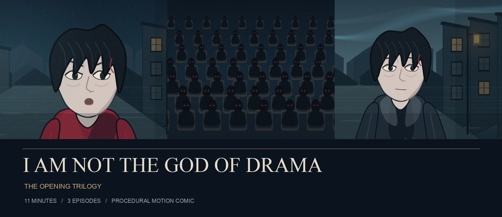
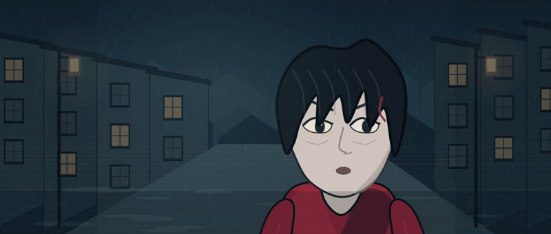
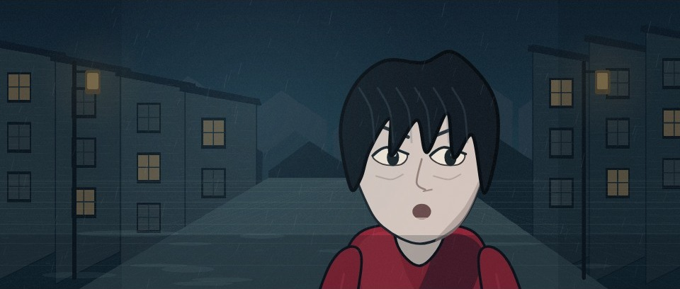
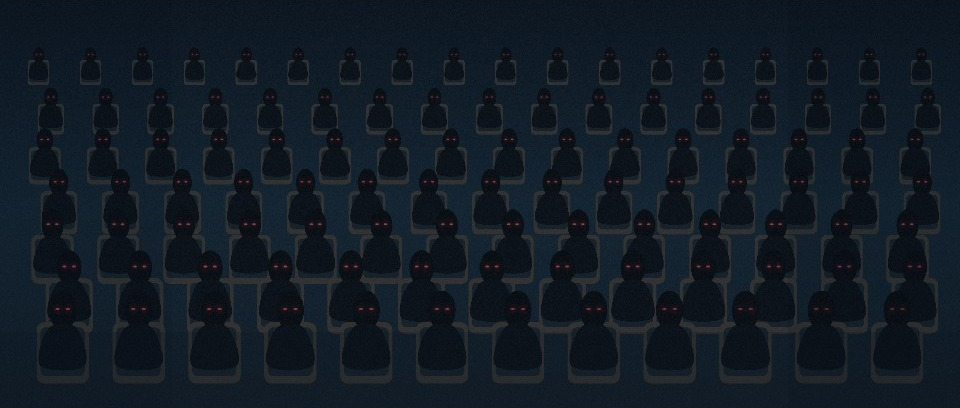
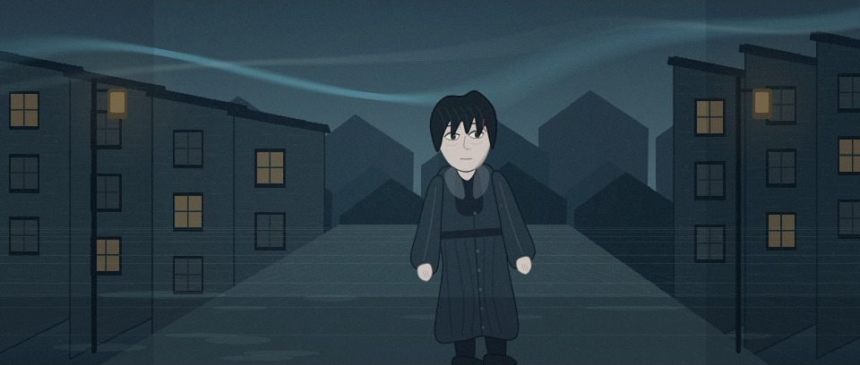
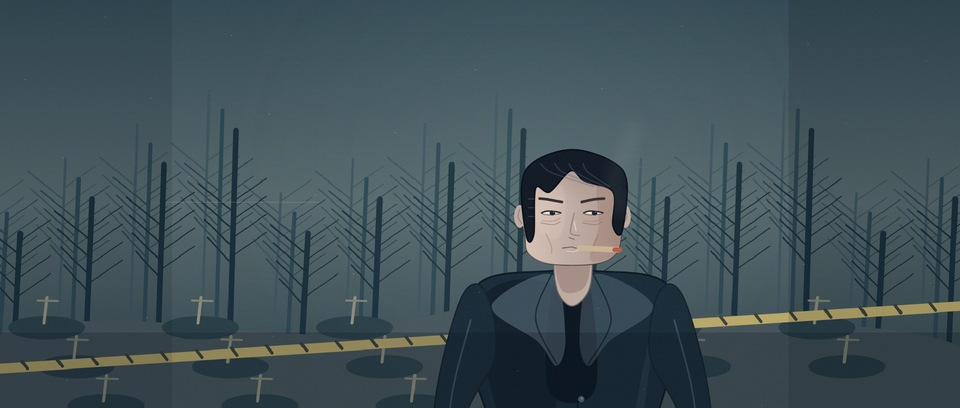
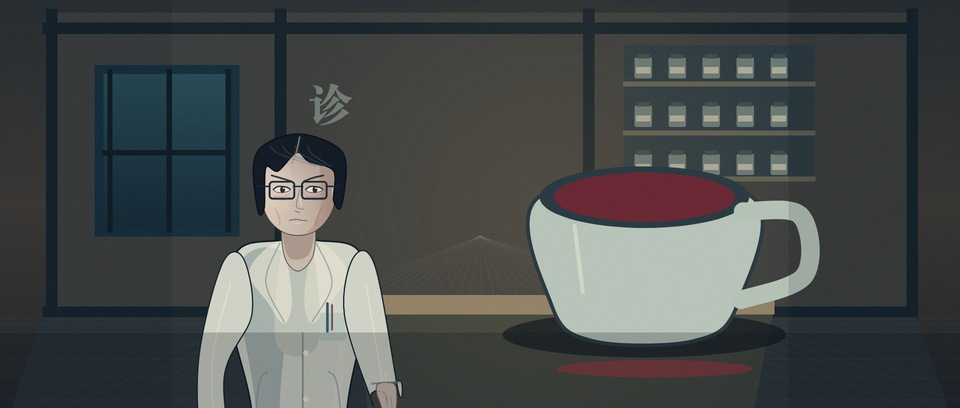
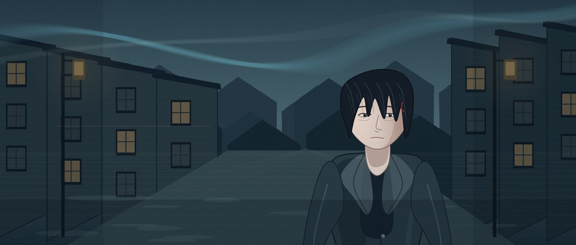
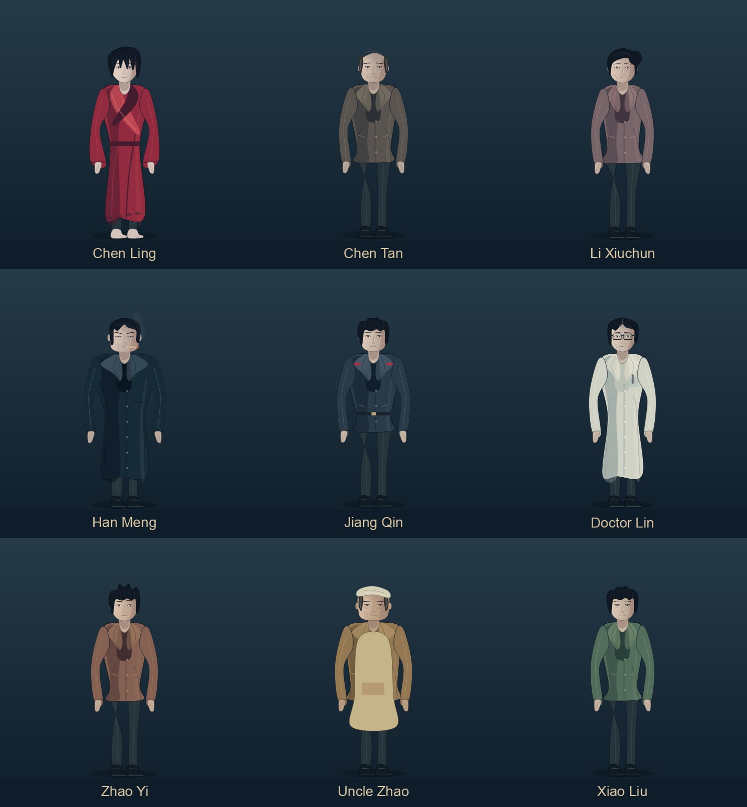

<div align="center">

# I Am Not the God of Drama

<p><sub>An example film made with <a href="../../README.md"><b>CodeCinema</b></a></sub></p>

**The Opening Trilogy · Skia motion comic**

A rain-soaked return. An audience with crimson eyes. A director learning to survive his own stage.

[](https://zjucqr.github.io/CodeCinema/xishen/watch.html)
[](#three-episodes-one-timeline)
[](#three-episodes-one-timeline)
[](../../pyproject.toml)
[](../../LICENSE)



[**Watch online**](https://zjucqr.github.io/CodeCinema/xishen/watch.html) · [**Download the films**](https://github.com/ZJUCQR/CodeCinema/releases/tag/xishen) · [Source ledger](data/canon.json) · [Chinese guide](README.zh-CN.md)

</div>

Chen Ling comes home with two broken sets of memories. Behind a curtain, strangers are waiting for his performance. By morning, the nightmare has begun to leave traces in the real world.

This trilogy condenses **chapters 1–6** of Sanjiu Yinyu's novel in their original order, with newly written dialogue and narration. Shared character models, a continuity ledger and one story clock connect all three episodes. The film combines a shared, individually designed cast and camera motion with emotion-directed Mandarin voices, an original synthesized score and foley. Dialogue mouths follow the final waveform and aligned syllable timestamps; narration and thoughts leave them closed. Footage keeps only the bottom captions and story props, without persistent titles or explanatory overlays.

All three episodes use the same Skia character designs and visual style, with a scene-led chamber score that distinguishes rain, theatre, investigation, wonder and comedy cues. Character appearance, shot timing and story state remain continuous throughout the trilogy.

## See the atmosphere

<p align="center"></p>

<p align="center"><sub>Excerpts from the actual rendered episodes. Documentation previews omit the caption bars; the films include Mandarin captions.</sub></p>

| The rain-soaked return | The audience | Aurora over the district |
| :---: | :---: | :---: |
|  |  |  |
| **A fractured identity** | **Every move is watched** | **The world beyond the curtain** |

| Han Meng | Doctor Lin's clinic | A new directing experiment |
| :---: | :---: | :---: |
|  |  |  |

## Three episodes, one timeline

| Episode | Title | Original chapters | Runtime | Download |
| --- | --- | --- | --- | --- |
| 01 | **The Ghost Comes Home** | 1 | 3:30 | [MP4](https://github.com/ZJUCQR/CodeCinema/releases/download/xishen/ep01.mp4) |
| 02 | **We Are Watching You** | 2–3 | 3:30 | [MP4](https://github.com/ZJUCQR/CodeCinema/releases/download/xishen/ep02.mp4) |
| 03 | **Chen's Directing Rules** | 4–6 | 4:00 | [MP4](https://github.com/ZJUCQR/CodeCinema/releases/download/xishen/ep03.mp4) |
| Complete | **The Opening Trilogy** | 1–6 | **11:00** | [MP4](https://github.com/ZJUCQR/CodeCinema/releases/download/xishen/xishen_complete.mp4) |

**67 shots · 61 spoken cues · 1920 × 1080 · 24 fps · 2.35:1 picture area · Stereo audio**

Each master includes burned-in captions, a selectable subtitle track and chapter markers. The screening page provides episode selection, chapter navigation, automatic continuation and downloads, on desktop and mobile.

## Render and watch locally

Install CodeCinema and FFmpeg using the [getting-started guide](../../docs/GETTING_STARTED.md), then run these commands from the repository root:

```bash
python -m pip install -e ".[speech]"
python -m codecinema run xishen all --narration required --speech-engine local
python -m codecinema run xishen serve
```

Open **http://127.0.0.1:8000/watch.html**. The local server supports byte-range requests, so chapter jumps and scrubbing work correctly. You can also open [watch.html](watch.html) directly after generation.

The outputs are `assets/film/ep01.mp4`, `ep02.mp4`, `ep03.mp4` and `xishen_complete.mp4`, relative to this folder. Rendered films and intermediate media are ignored by Git; the [release](https://github.com/ZJUCQR/CodeCinema/releases/tag/xishen) provides the finished masters.

**Expressive voices:** the published edition uses Qwen3-TTS CustomVoice and Qwen3 ForcedAligner locally on an Apple Silicon Mac. The optional speech pack downloads the models on first use; after that, the takes are cached. No API key is needed. The default `--speech-engine auto` uses this pack when installed, with a basic macOS system-voice fallback. `--speech-engine local` requires the expressive engine and prevents fallback.

**Other platforms:** supply recordings as `assets/voices/<shot_id>.wav` and use `--speech-engine recording --narration required`. Without the local aligner, mouths follow audio activity rather than aligned syllables. `--narration off` creates a captions-and-music edition. Install a CJK font such as Noto Serif CJK, or set `XISHEN_FONTS_SONG` and `XISHEN_FONTS_KAITI` to font files. Font and voice choices affect the result across platforms. See the [speech guide](../../docs/SPEECH.md) for reusable framework APIs and starter controls.

## Character and story continuity

<details>
<summary><b>View the shared cast sheet</b></summary>



The sheet shows the same cast used throughout all three episodes. Clothing, props, locations and event order follow the sourced details in the opening chapters.

</details>

- Chen Ling begins barefoot in a red stage robe. His forehead injury appears after the fall; the black padded coat is introduced the next morning and continues through episode 3.
- Han Meng keeps his dark overcoat and rolled cigarette. His cheek injury appears only after the detector explodes.
- Doctor Lin retains his white coat and black-framed glasses. Chen Yan is mentioned without an early on-screen appearance.
- Audience expectations follow **29 → 30 → 27 → 29 → 32**. Later increments do not invent a final total.
- The breakfast-shop romance is a staged misunderstanding. Later identities, powers and revelations are kept outside this adaptation's chapter range.

## Customize the production

| File | What to change |
| --- | --- |
| [data/episodes.json](data/episodes.json) | Shot order, durations, dialogue, narration, costumes and events |
| [data/canon.json](data/canon.json) | Source references, character designs, persistent voices and acting directions |
| [film.toml](film.toml) | Picture dimensions, frame rate, encoding, mix settings and worker count |
| [src/art.py](src/art.py) / [src/scenes.py](src/scenes.py) | Shared character designs, environments, performance and camera motion |
| [src/score.py](src/score.py) / [src/sound.py](src/sound.py) | Scene-led music, speech directions, timed foley and mixing |

For a quick, independent first film, use the [configurable starter](../../docs/GETTING_STARTED.md#make-it-yours) instead. This trilogy's source ledger and timeline are tailored to the novel.

<details>
<summary><b>Individual stages and a single-episode render</b></summary>

```bash
python -m codecinema run xishen plan
python -m codecinema run xishen stills
python -m codecinema run xishen audio --episode ep01 --narration required --speech-engine local
python -m codecinema run xishen render --episode ep01 --jobs 3 --narration required --speech-engine local
python -m codecinema run xishen assemble --episode ep01 --narration required --speech-engine local
python -m codecinema run xishen qc --episode ep01 --narration required --speech-engine local
```

Keep picture settings, narration mode and speech engine consistent across stages. Audio is prepared before picture rendering, including when `render` is run alone. Completed render chunks can be reused; changes to source or settings invalidate their signatures. Generated screenplay, continuity records and subtitle files live in `out/`.

</details>

## Verification and credits

Production QC checks source order, cross-episode state, glyph coverage, caption widths, deterministic frames, movement, duration, frame counts, subtitle tracks, chapter coverage, speaker ownership, dialogue timing, loudness, true peak and full decoding of all four masters. Results are generated locally in `out/qc.json`. Browser review covers chapter seeking, episode continuation and mobile layout.

Original novel: **Sanjiu Yinyu**, [official Fanqie edition](https://fanqienovel.com/page/7276384138653862966). Per-chapter references and adaptation choices are recorded in [the source ledger](data/canon.json) and [production plan](docs/FILM_PLAN.md). The novel's rights remain with its respective rights holders; the [MIT license](../../LICENSE) covers this repository's code.
